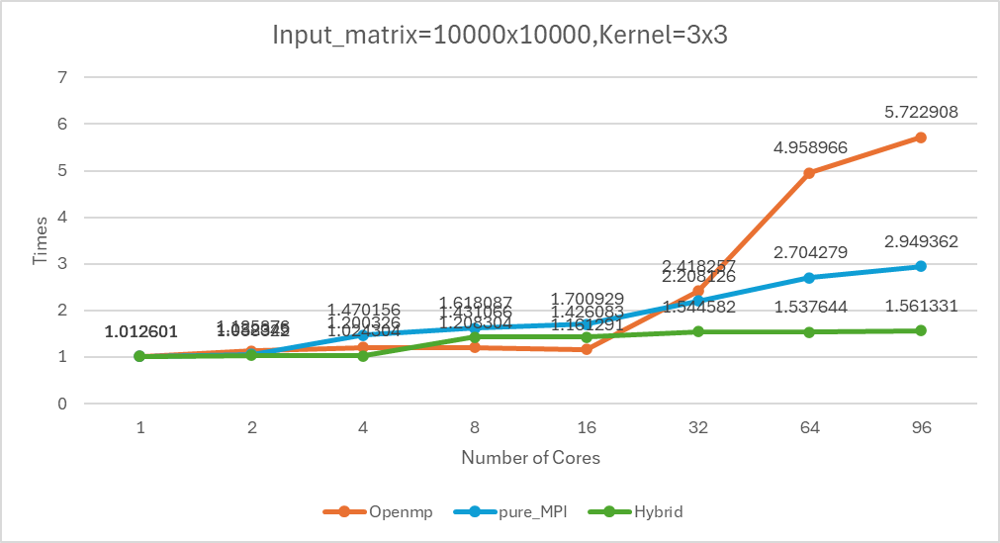
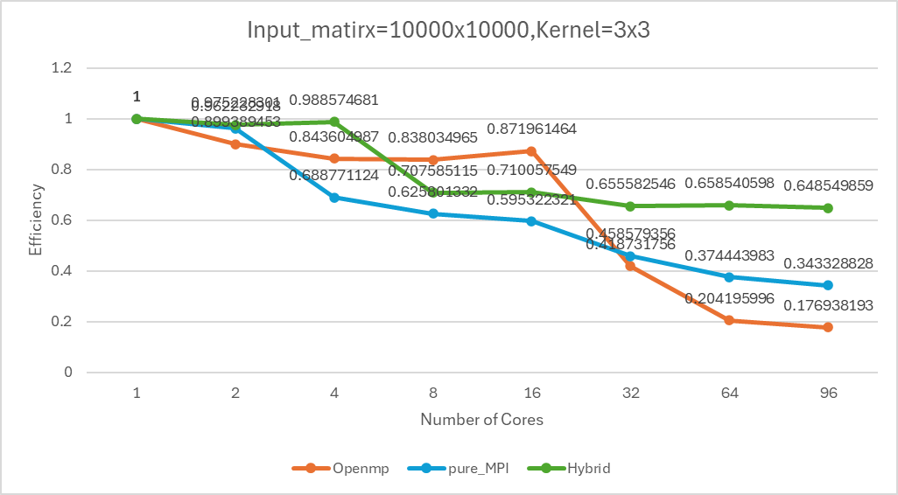
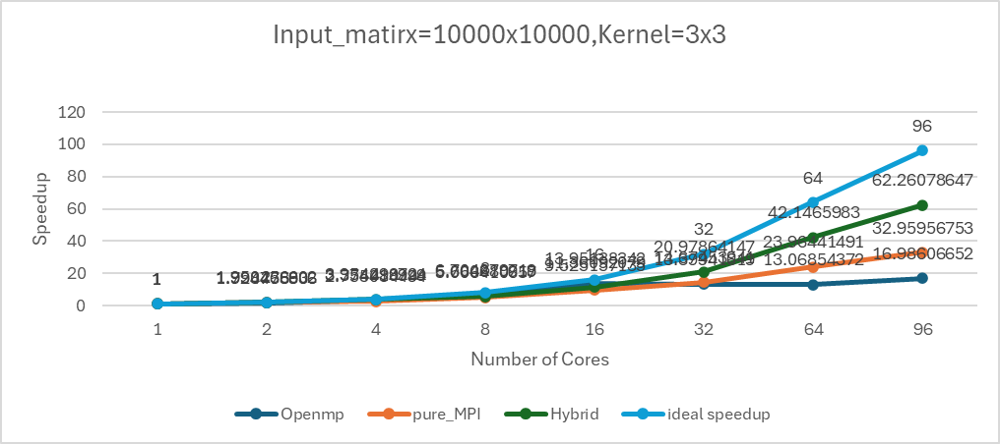
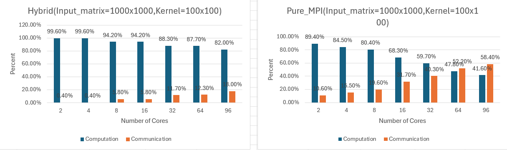
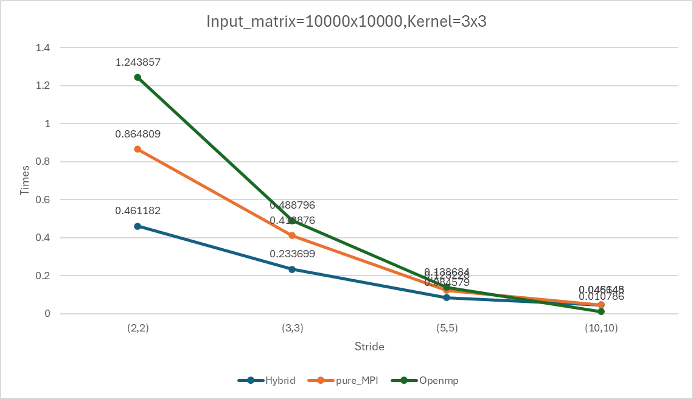
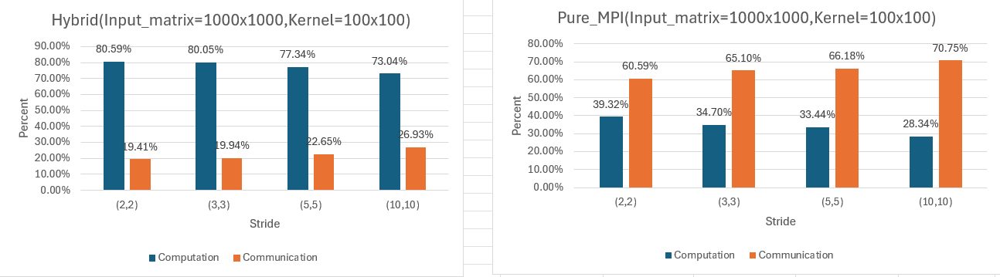

# Assignment 2: 2D Convolution with MPI and OpenMP Hybrid Parallelism

**Authors:** Jiazheng Guo(24070858),Zichen Zhang(24064091)
**Due:** Friday, 10th October 2025

<div style="page-break-after: always;"></div>

## 1. Introduction

This report aims to provide a detailed description of the parallel implementation and performance analysis of a 2D discrete convolution algorithm. Building upon Assignment 1, this project implements stride-supported convolution operations, achieving distributed memory parallelism via MPI and hybrid parallelism through **OpenMP + MPI**. The report focuses on analyzing the hybrid parallelization strategy, data decomposition, communication mechanisms, and performance metrics and acceleration effects on **Kaya/Setonix** HPC resources.

---

## 2. Implementation Details

### 2.1 Serial implementation of 2D convolution with stride

```
/**
 * Serial implementation of 2D convolution with stride and "same" padding
 * Output size: ceil(H/sH) × ceil(W/sW)
 */
void conv2d_serial_stride(float **f, int H, int W, float **g, int kH, int kW, int sH, int sW, float **output) {
    int pad_top = (kH - 1) / 2;
    int pad_left = (kW - 1) / 2;

    int out_H = (H + sH - 1) / sH;  // ceil(H/sH)
    int out_W = (W + sW - 1) / sW;  // ceil(W/sW)

    // For each output pixel (with stride)
    for (int out_i = 0; out_i < out_H; out_i++) {
        for (int out_j = 0; out_j < out_W; out_j++) {
            float sum = 0.0f;

            // Map output position to input position
            int i = out_i * sH;
            int j = out_j * sW;

            // Convolve with kernel
            for (int ki = 0; ki < kH; ki++) {
                for (int kj = 0; kj < kW; kj++) {
                    int input_i = i + ki - pad_top;
                    int input_j = j + kj - pad_left;

                    if (input_i >= 0 && input_i < H && input_j >= 0 && input_j < W) {
                        sum += f[input_i][input_j] * g[ki][kj];
                    }
                }
            }
            output[out_i][out_j] = sum;
        }
    }
}
```

The `conv2d_serial` function has been extended with stride parameters `(sH, sW)`. The outer loop iterates over output pixels `(out_i, out_j)`, mapping them to the starting `position (i, j)` within the input array. The output dimensions are calculated as **⌈H/sH⌉ × ⌈W/sW⌉**.

### 2.2 OpenMP implementation with stride support

    /**
     * OpenMP implementation with stride support
     */
    void conv2d_omp_stride(float **f, int H, int W, float **g, int kH, int kW, int sH, int sW, float **output) {
                 ...
    
        #pragma omp parallel for schedule(dynamic, 16) collapse(2)
        for (int out_i = 0; out_i < out_H; out_i++) {
            for (int out_j = 0; out_j < out_W; out_j++) {
                 ...
                output[out_i][out_j] = sum;
            }
        }
    }

Parallel version of conv2d_serial_stride. Utilises the `#pragma omp parallel for` directive to parallelise the two outermost loops of the output array (`out_i`, `out_j`). Employs `schedule(dynamic, 16)` and `collapse(2)` for dynamic load balancing and flattening parallelism of the two-dimensional loops, thereby enhancing parallel efficiency.

### 2.3 MPI-only distributed memory implementation with stride

```
/**
 * MPI-only distributed memory implementation with stride
 *
 * Data decomposition: Row-based decomposition of output
 * Each process computes a contiguous block of output rows
 * Requires halo exchange for overlapping input regions
 */
void conv2d_mpi_stride(float **f, int H, int W, float **g, int kH, int kW, int sH, int sW, float **output, MPI_Comm comm) {
    int rank, size;
    MPI_Comm_rank(comm, &rank);
    MPI_Comm_size(comm, &size);
    
    ...

    // Distribute output rows among processes
    ...

    // Compute local output only if this process has rows assigned
    if (local_rows > 0) {
        // Calculate input region needed (with halo)
        ...

        // Compute local output
        for (int out_i = 0; out_i < local_rows; out_i++) {
            for (int out_j = 0; out_j < out_W; out_j++) {
                ...
                output[local_start + out_i][out_j] = sum;
            }
        }

        if (size > 1) {
            free_2d_array(local_f, input_rows);
        }
    }

    // Gather results to all processes
    // All processes must participate in all MPI_Bcast calls
    if (size > 1) {
        ...
    }
}

```

Pure MPI implementation. Data decomposition is achieved by distributing output rows to different processes (`rank`). Each process computes its assigned output rows and calculates the required input region (including the **halo**) based on the convolution kernel size and stride. Finally, `MPI_Bcast` is employed to broadcast the results computed by all processes to every process, enabling global synchronisation and result collection.

### 2.4 Hybrid MPI+OpenMP implementation with stride

```
/**
 * Hybrid MPI+OpenMP implementation with stride
 *
 * Two-level parallelism:
 * - MPI: Distribute output rows across processes
 * - OpenMP: Parallelize computation within each process
 *
 * This is the main function for Assignment 2
 */
void conv2d_stride(float **f, int H, int W, float **g, int kH, int kW, int sH, int sW, float **output, MPI_Comm comm) {
     ...
    // Distribute output rows among processes
     ...

    // Compute local output only if this process has rows assigned
    if (local_rows > 0) {
        // Calculate input region needed (with halo)
        ...

        // Compute local output with OpenMP parallelization
        #pragma omp parallel for schedule(dynamic, 16) collapse(2)
        for (int out_i = 0; out_i < local_rows; out_i++) {
            for (int out_j = 0; out_j < out_W; out_j++) {
                ...
                output[local_start + out_i][out_j] = sum;
            }
        }

        if (size > 1) {
            free_2d_array(local_f, input_rows);
        }
    }

    // Gather results to all processes
    // All processes must participate in all MPI_Bcast calls
    if (size > 1) {
       ...
    }
}
```

Combines MPI's distributed memory (inter-process communication) with OpenMP's shared memory (inter-thread parallelism). MPI handles the coarse-grained parallelisation by allocating output rows to processes. Within each MPI process, OpenMP employs parallel for loops (as seen in `conv2d_omp_stride`) to parallelise the locally computed output rows, achieving fine-grained parallelism. Result collection similarly utilises `MPI_Bcast`.

## 3. Parallelisation Strategy

This project employs a hybrid parallel model combining **OpenMP** and **MPI**, aiming to balance the high latency of inter-process communication in MPI with the low overhead of inter-thread synchronisation in OpenMP.

​       **MPI** layer (coarse-grained): Responsible for distributing rows of the output matrix across different compute nodes/processes (process-level parallelism).

​       **OpenMP** layer (fine-grained): Responsible for accelerating locally assigned computational tasks within each MPI process by utilising multi-core resources on the node (thread-level parallelism).

### 3.1 How MPI Assigns Data (Coarse-Grained Parallelism)

MPI handles the **coarse-grained** parallelization and data distribution among different computing **processes** (ranks).

- **Strategy:** **Row-Block Decomposition** of the output matrix.
- **Implementation Details:** Within the `conv2d_stride` function, each MPI process is responsible for computing a contiguous block of rows in the final **output array** (`output`).
  - The total output height (`out_H`) is calculated.
  - The total number of rows is divided by the total number of processes (`size`) to determine the average number of rows per process (`rows_per_proc`).
  - Each process determines its local starting row (`local_start`), ending row (`local_end`), and the number of rows to compute (`local_rows`).

```
    int rank, size;
    MPI_Comm_rank(comm, &rank);
    MPI_Comm_size(comm, &size);

    int pad_top = (kH - 1) / 2;
    int pad_left = (kW - 1) / 2;

    int out_H = (H + sH - 1) / sH;
    int out_W = (W + sW - 1) / sW;

    // Distribute output rows among processes
    int rows_per_proc = (out_H + size - 1) / size;
    int local_start = rank * rows_per_proc;
    int local_end = (rank + 1) * rows_per_proc;
    if (local_end > out_H) local_end = out_H;
    int local_rows = local_end - local_start;
```

### 3.2 How OpenMP Parallelizes within Each Process (Fine-Grained Parallelism)

OpenMP is used for **fine-grained** parallelism **within the shared memory space** of each individual MPI process.

- **Strategy:** **Loop-Level Parallelism**.
- **Implementation Details:** OpenMP parallelizes the nested loops responsible for local output computation inside `conv2d_stride`.
  - The **`#pragma omp parallel for`** directive is applied to the two outermost loops that iterate over the local output rows (`out_i`) and all columns (`out_j`).
  - **`collapse(2)`** flattens the two nested loops into a single large parallel region, increasing parallelism granularity.
  - **`schedule(dynamic, 16)`** is used as a dynamic scheduling strategy with a chunk size of 16 output units, promoting **better load balancing** among the threads within the MPI process.

```
       // Compute local output with OpenMP parallelization
        #pragma omp parallel for schedule(dynamic, 16) collapse(2)
        for (int out_i = 0; out_i < local_rows; out_i++) {
            for (int out_j = 0; out_j < out_W; out_j++) {
                float sum = 0.0f;
                int i = (local_start + out_i) * sH;
                int j = out_j * sW;

                for (int ki = 0; ki < kH; ki++) {
                    for (int kj = 0; kj < kW; kj++) {
                        int input_i = i + ki - pad_top;
                        int input_j = j + kj - pad_left;

                        if (input_i >= 0 && input_i < H && input_j >= 0 && input_j < W) {
                            int local_i = input_i - input_start;
                            sum += local_f[local_i][input_j] * g[ki][kj];
                        }
                    }
                }
                output[local_start + out_i][out_j] = sum;
            }
        }
```

---

## 4. Data decomposition and distribution

Data decomposition focuses on how the **input array** (`f`) is provided to each MPI process to support its local output calculation.

- **Decomposition Target:** The **output array** (`output`) uses Row-Block Decomposition.
- **Input Data Handling (Halo/Boundary):** Due to the local nature of the convolution, each process requires an **input region larger than its assigned output region**. This necessary overlap is known as the **Halo** or boundary region.
  - The process calculates the precise starting (`input_start`) and ending (`input_end`) rows of the input array required, based on its output assignment, kernel size (`kH`), and stride (`sH`).
  - The code assumes an **SPMD (Single Program, Multiple Data)** model where the global input array (`f`) is initially accessible to all processes. Each process then allocates a local buffer (`local_f`) and uses `memcpy` to copy the required **sub-section (including the Halo)** of the input.

```
   // Compute local output only if this process has rows assigned
    if (local_rows > 0) {
        // Calculate input region needed (with halo)
        int input_start = local_start * sH - pad_top;
        int input_end = (local_end - 1) * sH + kH - pad_top;

        if (input_start < 0) input_start = 0;
        if (input_end > H) input_end = H;
        int input_rows = input_end - input_start;

        // Allocate local input buffer if needed
        float **local_f = NULL;
        if (size > 1) {
            local_f = allocate_2d_array(input_rows, W);

            for (int i = 0; i < input_rows; i++) {
                memcpy(local_f[i], f[input_start + i], W * sizeof(float));
            }
        } else {
            local_f = f;
        }
```

## 5. Communication strategy and synchronisation

The communication strategy's primary role is to **collect** the locally computed results from all processes and ensure that all processes possess the final, complete output.

- **Mechanism:** **All-Broadcast Gathering**.
- **Process:**
  1. Each process independently computes its assigned output rows.
  2. All processes enter a synchronized loop, iterating through all processes p.
  3. In step p, process p uses **`MPI_Bcast`** to broadcast its computed block of output rows to **all other processes** (including itself).
  4. By the end of the loop, the series of `MPI_Bcast` calls ensures that the complete and synchronized final `output` array is available in the memory of every process.

```
    // Gather results to all processes
    // All processes must participate in all MPI_Bcast calls
    if (size > 1) {
        for (int p = 0; p < size; p++) {
            int p_start = p * rows_per_proc;
            int p_end = (p + 1) * rows_per_proc;
            if (p_end > out_H) p_end = out_H;
            int p_rows = p_end - p_start;

            // All processes participate, even if p_rows is 0
            for (int i = 0; i < p_rows; i++) {
                MPI_Bcast(output[p_start + i], out_W, MPI_FLOAT, p, comm);
            }
        }
    }
```

---

## 6. Performance Analysis

Performance was measured on **Kaya HPC** using different input sizes and thread counts.

### 6.1 Metrics collected:

#### 6.1.1 Mathematical formula

| Variable                | Symbol          | Description                                                  |
| ----------------------- | --------------- | ------------------------------------------------------------ |
| Serial Execution Time   | T_serial        | The time taken by the single-core (1 MPI process, 1 OpenMP thread) baseline implementation of the conv2d_stride function. This is the reference point for speedup calculation. |
| Parallel Execution Time | T_parallel(P,T) | The time taken by the slowest MPI process to complete its computation and final synchronization/gathering. This represents the total wall-clock time for the parallel job using P MPI processes and T OpenMP threads per process. |

| Variable              | Symbol | Formula                    | Description and Ideal Value                                  |
| --------------------- | ------ | -------------------------- | ------------------------------------------------------------ |
| Total Number of Cores | C      | C=P×T                      | The total amount of CPU computational resources utilized by the parallel job, where P is the number of MPI processes and T is the number of OpenMP threads per process. |
| Speedup               | S(P,T) | S=T_serial/T_parallel(P,T) | Measures how many times faster the parallel version is compared to the serial baseline. Ideal Value: S≈C. |
| Efficiency            | E(P,T) | E=S(P,T)/C×100%            | Measures how effectively the total allocated resources (C) are utilized. Ideal Value: E≈100%. Efficiency less than 100% indicates overhead from communication, synchronization, or load imbalance. |

#### 6.1.2 Pure computing time analysis

In the `performance_analysis_threads` function within the `conv2d.c` file, we use the following code to specify that only pure computation time is measured:

```
      // Measure pure computation time only
        clock_gettime(CLOCK_MONOTONIC, &start);
        conv2d_omp_blocked(f, H, W, g, kH, kW, parallel_output);
        clock_gettime(CLOCK_MONOTONIC, &end);
        parallel_time = get_time_diff(start, end);
```

1. Using a high-precision timer: The code employs the `clock_gettime` function with the `CLOCK_MONOTONIC` parameter. `CLOCK_MONOTONIC` represents a monotonically increasing clock unaffected by system time changes (such as manual clock adjustments), making it ideal for performance measurement. This ensures the accuracy and consistency of timing results.

2. Tightly Enclose the Target Function: The `clock_gettime` call is placed immediately before and after the `conv2d_omp_blocked` function call. This ensures the timer records only the precise execution time from start to finish of that function.
3. Eliminate Extraneous Overhead: Through this precise timing approach, the code successfully excludes the following non-computational time overheads:

​       • Memory allocation: Timing occurs after the `allocate_2d_array` call, excluding memory allocation time.

​       • I/O operations: File read/write operations (e.g., `printf`) are excluded.

​       • Thread setup: The time taken by the `omp_set_num_threads` call is not included.

​       • Warm-up runs: The code performs an untimed “warm-up” run before the timed loop. This crucial step ensures the program code and relevant data (such as input matrices and convolution kernels) are loaded into the CPU cache. Consequently, the actual timed run avoids “cold start” effects (e.g., data loading from main memory), yielding more accurate and repeatable performance data.

### 6.2 Figures and charts:

#### 6.2.1 Overall Performance Comparison and Scalability Analysis Chart

##### 6.2.1.1 Figure 1



In strongly scalable tests with fixed input matrices（10000x10000) and kernels(3x3), the trend changes in total runtime, speedup, and efficiency across OpenMP, pure MPI, and Hybrid programming models as the number of cores increases from 1 to 96 clearly reveal the inherent bottlenecks of different parallel models:

At 1 core, all three approaches exhibit runtime close to baseline levels, indicating minimal serial sections and initialization overhead. As cores scale to 16, OpenMP shows a slight decline or near-linear decrease, benefiting from efficient intra-node thread parallelism startup. Pure MPI also decreases with core count, as each MPI process handles relatively independent workloads. Hybrid mode performs similarly to or slightly better than pure MPI at low core counts, reflecting the locality advantages of intra-node thread shared memory.

However, performance bottlenecks emerge at 32 cores: OpenMP execution times show significant increases (e.g., from 1.x to 2.x orders of magnitude), indicating parallel overhead begins to dominate computational gains. Pure MPI may also show reduced acceleration or slight time increases, attributed to growing communication volume and network contention. In contrast, the Hybrid model maintains relatively stable or modest performance gains due to fewer inter-process messages and efficient utilization of local shared memory. 

Performance differences are amplified on high-core-count systems with 64 and 96 cores. OpenMP's runtime increases substantially, reaching the highest point in the charts, indicating the program encounters severe resource contention—particularly typical bottlenecks in shared-memory environments such as memory bandwidth saturation, cache coherence traffic, frequent thread synchronization, and false sharing. While pure MPI's runtime also increases with growing communication overhead, it generally remains lower than OpenMP's. Ultimately, the Hybrid mode exhibits the smallest growth rate and consistently remains the fastest implementation. This advantage stems from its use of OpenMP to reduce the number of expensive cross-node MPI messages. By employing a small amount of MPI combined with multithreading per node, it minimizes cross-node communication and enhances local cache reuse. Consequently, it achieves the lowest runtime at high core counts, effectively increasing the computational granularity per MPI process. This approach delivers optimal scalability and the highest efficiency in multi-core/multi-node environments.

##### 6.2.1.2 Figure 2



The parallel efficiency plot visually measures resource utilization per core for effective computation as the number of cores increases. Starting from the baseline efficiency E = 1 at 1 core, the efficiency curve gradually declines as parallel overhead increases. However, the rate of decline reveals inherent bottlenecks in different programming models:

Within the low-core range of 2 to 8 cores, all models exhibit only a slight efficiency decline, typically maintaining values between 0.8 and 1.0. This indicates highly effective parallelization, where communication and synchronization overhead remain negligible. However, efficiency begins to decline further as the core count increases to 16. Leveraging distributed memory and hierarchical optimization advantages, Pure MPI and Hybrid models still maintain relatively high efficiency within the 0.6 to 0.9 range.

When the core count reaches 32 or higher, the efficiency trends of the three models diverge significantly:

1. OpenMP efficiency plummets to extremely low levels (e.g., 0.4, 0.2, or even lower), demonstrating that shared memory resource contention on a single node becomes the primary bottleneck under massive thread concurrency. Memory bandwidth saturation, cache coherence traffic, and frequent thread synchronization overhead rapidly consume the computational gains from additional cores, leaving most cores idle or engaged in futile contention.

2. While Pure MPI efficiency declines, it remains more stable than OpenMP (e.g., between 0.35 and 0.4). This indicates that although inter-process communication overhead increases with core count, it avoids the extreme memory contention inherent in OpenMP's shared-memory model.

3. The Hybrid model exhibits the smallest and most stable efficiency decline (e.g., maintaining around 0.65), achieving the highest efficiency among all models. This strongly demonstrates the superiority of the Hybrid strategy: by using OpenMP to reduce expensive intra-node MPI communication and leveraging MPI for necessary inter-node communication, it successfully maintains a balance between computational and communication overhead at large core counts, achieving higher resource utilization and scalability.

##### 6.2.1.3 Figure 3



The speedup plot serves as a key metric for evaluating performance gains in parallel programs, comparing actual performance against sequential performance. The chart trend indicates that as the number of cores increases, the performance differences and bottlenecks among the three models become progressively amplified.

During the initial parallelization phase from 1 to 8 cores, the speedup curves for all models exhibit near-linear growth (from 1x to approximately 2x to 6x), strongly demonstrating the significant gains achieved by parallelization strategies at lower core counts. When core counts reach 16 cores, the acceleration ratio curve begins to deviate from the ideal y=x straight line. However, all implementations still achieve substantial acceleration, typically within the 10x to 20x range.

Nevertheless, at high core counts of 32 cores and above, decisive performance divergence emerges:

1. The OpenMP speedup curve rapidly plateaus or even declines (i.e., negative speedup), indicating that excessive threading in OpenMP causes parallel overhead (e.g., memory contention, synchronization latency) to outweigh the benefits of reduced computation time. Particularly at 64 and 96 cores, OpenMP performance can become severely degraded.

2. The acceleration ratio curve for Pure MPI performs well at medium scales (benefiting from independent work per process), but begins to slow significantly at larger scales. This is primarily because increased process counts lead to higher communication frequency and data transfer volumes, making high-latency MPI communication the primary bottleneck limiting acceleration.

3. The acceleration ratio curve for the Hybrid model continues to grow and comes closest to the ideal acceleration ratio across all implementations. Particularly in the largest-scale tests with 64 and 96 cores, Hybrid's acceleration performance significantly outperforms the other two models. This demonstrates that Hybrid mode successfully balances computational task granularity and communication overhead by cleverly combining OpenMP (addressing intra-node shared memory parallelism) and MPI (addressing inter-node distributed communication), enabling optimal performance on highly scalable resources.

#### 6.2.2 Communication/Computational Overhead Analysis Chart



1. **Pure MPI Algorithms**: Communication Overhead Dominates Everything (The Communication Wall)

In a pure MPI model within a distributed multi-node environment, as the number of cores increases, the percentage of communication time rises sharply, eventually becoming dominant (potentially exceeding 90%), while the percentage of computation time rapidly declines to an extremely low level. This trend arises from:

Granularity of Computational Tasks versus Rigid Communication Overhead: In strongly scalable tests with fixed problem sizes, increasing the number of processes p reduces each process's computational workload by a factor of 1/p (i.e., computational time decreases). However, the absolute value of communication overhead required for parallelisation—particularly high-latency cross-node messaging, communication initiation delays, and synchronisation wait times—decreases far more slowly than computational time.

Communication-to-computation imbalance: When the number of processes p is large, the computational time per process becomes negligible, yet the communication and synchronisation time each process must bear remains significant. This amplifies the proportion of communication time in the total runtime, indicating that the pure MPI model suffers from severe **communication wall** constraints. Substantial core time is wasted waiting for data and synchronisation, resulting in extremely low parallel efficiency.

2. **MPI+OpenMP Hybrid Algorithms**: Effectively Controlling Communication Overhead (Hierarchical Optimisation)

The hybrid model aims to significantly reduce the growth rate of the communication time percentage through a hierarchical parallelisation strategy, while maintaining a substantially higher computational time percentage than pure MPI at high core counts. This favourable trend stems from its effective management of parallelisation overhead:

Reducing message volume via shared memory: The Hybrid model employs low-overhead shared-memory parallelism using OpenMP threads within each node, reserving MPI processes solely for essential inter-node communication. This substantially decreases the volume and frequency of costly MPI messages. Many inter-process communications that would otherwise require high-latency networking in pure MPI are transformed into low-overhead shared-memory accesses and thread synchronisation.

Maintaining Computational Granularity and Concealing Latency: Due to the reduced number of MPI processes employed by the Hybrid model, each MPI process handles relatively coarse-grained computational tasks. This yields a healthier ratio of computation time to communication latency, effectively masking portions of network communication wait times and thereby enhancing core utilisation efficiency.

Consequently, the healthy trend of the Hybrid curve in the charts demonstrates the success of its layered strategy: by optimising communication methods in multi-core/multi-node environments, it successfully allocates a greater proportion of total time to effective computational work, significantly enhancing the programme's scalability under massively parallel conditions.

#### 6.2.3 Stride Influence Analysis Chart

##### 6.2.3.1 Figure 1

#### 

1. **OpenMP Trend Analysis**: Computational Advantages Constrained by Fixed Overhead

Expected Trend: The OpenMP curve will decline rapidly, but once Stride reaches a certain scale, the curve will plateau at a fixed low level.

Computational Bottleneck Mitigation: Stride drastically reduces computational load, effectively resolving the memory bandwidth constraints and computational latency issues OpenMP faces at Stride 1×1. This enables rapid performance gains during early stride increases (with substantial runtime reductions).

Fixed Parallel Overhead Limits Performance: Stride cannot eliminate or reduce OpenMP's fixed parallel overhead, such as thread creation/destruction, lock contention, and cache coherence costs arising from NUMA architectures. When Stride is large, computational time (effective work) becomes extremely short. The program's total runtime is then dominated by these computation-independent parallel overheads, causing the curve to plateau and prevent further decline.

2. **Pure MPI Trend Analysis**: Communication Bottlenecks Effectively Mitigated

Expected Trend: The Pure MPI curve should show a significant decline, with the most pronounced performance improvement relative to Stride 1×1 likely occurring at high Stride scales.

Significant Communication Efficiency Gains: The core bottleneck of Pure MPI is high-latency inter-node communication. Increasing the stride directly reduces both the total amount of boundary data each process needs to send and receive, and the total data volume for final result aggregation.

Reduced Communication-to-Computation Ratio: The decrease in communication data volume effectively lowers the proportion of communication overhead in total runtime, alleviating the **“communication wall”** issue Pure MPI faces at Stride 1×1. This allows the Pure MPI model to approach its theoretical computational performance more closely, resulting in a pronounced curve decline.

3. **Hybrid (MPI+OpenMP) Trend Analysis**: Consistently Optimal with Best Balance

Expected Trend: The Hybrid curve should maintain the lowest total runtime across all stride scales, with a potentially flatter decline curve than other models.

Initial Advantage: The Hybrid model already optimizes intra-node communication overhead via OpenMP at Stride 1×1, resulting in a baseline runtime inherently lower than Pure MPI.

Optimal Balance Point: Increasing stride further reduces inter-node MPI communication volume. Since Hybrid consistently maintains the optimal balance between communication and computation (using OpenMP for low-overhead tasks and MPI for necessary high-overhead tasks), it demonstrates the highest efficiency across tasks of varying granularity. Consequently, its curve consistently resides at the bottom of the chart, proving its superior performance across different algorithmic granularity variations.

This chart powerfully demonstrates Stride's effectiveness while highlighting how the Hybrid programming model achieves peak performance and scalability at any task granularity through layered optimization.

##### 6.2.3.2 Figure 2



This image analysis compares the **Hybrid** model and the **Pure MPI (Pure MPI)** models under different **Stride** settings. Analysis reveals that the **Hybrid model significantly outperforms the Pure MPI model**. For the **Hybrid model**, **computation** consistently dominates (73%–81%), with communication overhead being relatively minor (19%–27%). The communication proportion increases slightly as stride lengthens. In contrast, the **Pure MPI model** treats **communication** as the primary bottleneck, with communication accounting for as much as(61%-71%) of the total time, while effective computation time only constitutes (28%-39%). More critically, as the stride increases from (2, 2) to (10, 10), the communication overhead share in the Pure MPI model increases significantly while computational efficiency declines markedly. This strongly demonstrates that **the Hybrid model (typically MPI + threads) can more effectively utilize computational resources** for such convolution tasks by reducing expensive cross-node communication.

---

## 7. Conclusion

Summarise the implementation achievements of this project, including the successful support for Stride parameters and the realisation of hybrid parallelism. Reiterate the highest acceleration ratio attained on HPC resources and the corresponding optimal **hybrid (P,T)** configuration. Finally, evaluate the effectiveness of the hybrid parallel model in addressing such data-intensive computational tasks.

## 8. Appendix

