# Assignment 2: 2D Convolution with MPI and OpenMP Hybrid Parallelism

**Authors:** Jiazheng Guo(24070858),Zichen Zhang(24064091)
**Due:** Friday, 17th October 2025

<div style="page-break-after: always;"></div>

## 1. Introduction

This report aims to provide a detailed description of the parallel implementation and performance analysis of a 2D discrete convolution algorithm. Building upon Assignment 1, this project implements stride-supported convolution operations, achieving distributed memory parallelism via MPI and hybrid parallelism through **OpenMP + MPI**. The report focuses on analyzing the hybrid parallelization strategy, data decomposition, communication mechanisms, and performance metrics and acceleration effects on **Kaya/Setonix** HPC resources.

---

## 2. Implementation Details

### 2.1 Algorithm Parallelization Strategy

Our 2D convolution algorithm employs a **hybrid parallelization approach** that combines both **distributed memory** (MPI) and **shared memory** (OpenMP) paradigms to achieve optimal performance across multi-node HPC systems.

#### 2.1.1 Distributed Memory Parallelization (MPI)

**Memory Model:** Each MPI process operates in its own **private memory space** with no direct access to other processes' memory. Communication occurs through explicit message passing.

**Parallelization Strategy:** 
- **Row-block decomposition** of the output matrix across MPI processes
- Each process computes a contiguous block of output rows independently
- **SPMD (Single Program, Multiple Data)** model where all processes execute the same code on different data partitions

**Key Implementation Details:**
```c
// Each process determines its assigned output rows
int rows_per_proc = (out_H + size - 1) / size;
int local_start = rank * rows_per_proc;
int local_end = (rank + 1) * rows_per_proc;
int local_rows = local_end - local_start;
```

**Communication Requirements:**
- **Input data preparation:** Each process creates local buffers containing required input regions plus halo data
- **Result collection:** All processes participate in collective `MPI_Bcast` operations to gather complete results

#### 2.1.2 Shared Memory Parallelization (OpenMP)

**Memory Model:** All OpenMP threads within an MPI process share the **same memory address space**, enabling direct access to shared data structures.

**Parallelization Strategy:**
- **Loop-level parallelism** applied to the nested output computation loops
- **Dynamic scheduling** with chunk size optimization for load balancing
- **Collapsed parallelism** to increase parallel granularity

**Key Implementation Details:**
```c
// OpenMP parallelizes the local computation within each MPI process
#pragma omp parallel for schedule(dynamic, 16) collapse(2)
for (int out_i = 0; out_i < local_rows; out_i++) {
    for (int out_j = 0; out_j < out_W; out_j++) {
        // Each thread computes independent output pixels
        // No synchronization needed within the parallel region
    }
}
```

**Thread Coordination:**
- **Implicit synchronization** at the end of parallel regions
- **Private variables** for thread-local computations (e.g., `sum`)
- **Shared read-only data** (input arrays, kernel) accessed by all threads

#### 2.1.3 Hybrid Integration

**Two-Level Parallelism:**
1. **Coarse-grained (MPI):** Distributes work across nodes/processes
2. **Fine-grained (OpenMP):** Parallelizes computation within each node

**Memory Hierarchy Utilization:**
- **Distributed memory:** Handles inter-node communication and data distribution
- **Shared memory:** Exploits multi-core parallelism within each node
- **Cache optimization:** Row-major access patterns and local buffer management

**Load Balancing:**
- **MPI level:** Static row-block distribution with dynamic OpenMP scheduling
- **OpenMP level:** Dynamic scheduling with 16-element chunks prevents thread starvation

### 2.2 Serial implementation of 2D convolution with stride

```
/**
 * Serial implementation of 2D convolution with stride and "same" padding
 * Output size: ceil(H/sH) × ceil(W/sW)
 */
void conv2d_serial_stride(float **f, int H, int W, float **g, int kH, int kW, int sH, int sW, float **output) {
    int pad_top = (kH - 1) / 2;
    int pad_left = (kW - 1) / 2;

    int out_H = (H + sH - 1) / sH;  // ceil(H/sH)
    int out_W = (W + sW - 1) / sW;  // ceil(W/sW)

    // For each output pixel (with stride)
    for (int out_i = 0; out_i < out_H; out_i++) {
        for (int out_j = 0; out_j < out_W; out_j++) {
            float sum = 0.0f;

            // Map output position to input position
            int i = out_i * sH;
            int j = out_j * sW;

            // Convolve with kernel
            for (int ki = 0; ki < kH; ki++) {
                for (int kj = 0; kj < kW; kj++) {
                    int input_i = i + ki - pad_top;
                    int input_j = j + kj - pad_left;

                    if (input_i >= 0 && input_i < H && input_j >= 0 && input_j < W) {
                        sum += f[input_i][input_j] * g[ki][kj];
                    }
                }
            }
            output[out_i][out_j] = sum;
        }
    }
}
```

The `conv2d_serial` function has been extended with stride parameters `(sH, sW)`. The outer loop iterates over output pixels `(out_i, out_j)`, mapping them to the starting `position (i, j)` within the input array. The output dimensions are calculated as **⌈H/sH⌉ × ⌈W/sW⌉**.

### 2.3 OpenMP implementation with stride support

    /**
     * OpenMP implementation with stride support
     */
    void conv2d_omp_stride(float **f, int H, int W, float **g, int kH, int kW, int sH, int sW, float **output) {
                 ...
    
        #pragma omp parallel for schedule(dynamic, 16) collapse(2)
        for (int out_i = 0; out_i < out_H; out_i++) {
            for (int out_j = 0; out_j < out_W; out_j++) {
                 ...
                output[out_i][out_j] = sum;
            }
        }
    }

Parallel version of conv2d_serial_stride. Utilises the `#pragma omp parallel for` directive to parallelise the two outermost loops of the output array (`out_i`, `out_j`). Employs `schedule(dynamic, 16)` and `collapse(2)` for dynamic load balancing and flattening parallelism of the two-dimensional loops, thereby enhancing parallel efficiency.

### 2.4 MPI-only distributed memory implementation with stride

```
/**
 * MPI-only distributed memory implementation with stride
 *
 * Data decomposition: Row-based decomposition of output
 * Each process computes a contiguous block of output rows
 * Requires halo exchange for overlapping input regions
 */
void conv2d_mpi_stride(float **f, int H, int W, float **g, int kH, int kW, int sH, int sW, float **output, MPI_Comm comm) {
    int rank, size;
    MPI_Comm_rank(comm, &rank);
    MPI_Comm_size(comm, &size);
    
    ...

    // Distribute output rows among processes
    ...

    // Compute local output only if this process has rows assigned
    if (local_rows > 0) {
        // Calculate input region needed (with halo)
        ...

        // Compute local output
        for (int out_i = 0; out_i < local_rows; out_i++) {
            for (int out_j = 0; out_j < out_W; out_j++) {
                ...
                output[local_start + out_i][out_j] = sum;
            }
        }

        if (size > 1) {
            free_2d_array(local_f, input_rows);
        }
    }

    // Gather results to all processes
    // All processes must participate in all MPI_Bcast calls
    if (size > 1) {
        ...
    }
}

```

Pure MPI implementation. Data decomposition is achieved by distributing output rows to different processes (`rank`). Each process computes its assigned output rows and calculates the required input region (including the **halo**) based on the convolution kernel size and stride. Finally, `MPI_Bcast` is employed to broadcast the results computed by all processes to every process, enabling global synchronisation and result collection.

### 2.5 Hybrid MPI+OpenMP implementation with stride

```
/**
 * Hybrid MPI+OpenMP implementation with stride
 *
 * Two-level parallelism:
 * - MPI: Distribute output rows across processes
 * - OpenMP: Parallelize computation within each process
 *
 * This is the main function for Assignment 2
 */
void conv2d_stride(float **f, int H, int W, float **g, int kH, int kW, int sH, int sW, float **output, MPI_Comm comm) {
     ...
    // Distribute output rows among processes
     ...

    // Compute local output only if this process has rows assigned
    if (local_rows > 0) {
        // Calculate input region needed (with halo)
        ...

        // Compute local output with OpenMP parallelization
        #pragma omp parallel for schedule(dynamic, 16) collapse(2)
        for (int out_i = 0; out_i < local_rows; out_i++) {
            for (int out_j = 0; out_j < out_W; out_j++) {
                ...
                output[local_start + out_i][out_j] = sum;
            }
        }

        if (size > 1) {
            free_2d_array(local_f, input_rows);
        }
    }

    // Gather results to all processes
    // All processes must participate in all MPI_Bcast calls
    if (size > 1) {
       ...
    }
}
```

Combines MPI's distributed memory (inter-process communication) with OpenMP's shared memory (inter-thread parallelism). MPI handles the coarse-grained parallelisation by allocating output rows to processes. Within each MPI process, OpenMP employs parallel for loops (as seen in `conv2d_omp_stride`) to parallelise the locally computed output rows, achieving fine-grained parallelism. Result collection similarly utilises `MPI_Bcast`.

### 2.6 Array Representation Communication and Memory Management

#### 2.6.1 Data Structure Design

Our implementation uses a **two-dimensional array of pointers** (`float**`) representation for all arrays:

```c
// Array representation: float** (array of pointers)
float **f;      // Input array: f[H][W]
float **g;      // Kernel array: g[kH][kW] 
float **output; // Output array: output[out_H][out_W]
```

**Memory Layout Details:**
- **Row pointers**: Each array is an array of pointers, where each pointer points to a row of data
- **Row-major storage**: Within each row, elements are stored consecutively in memory
- **Dynamic allocation**: Memory is allocated at runtime using `allocate_2d_array()`

#### 2.6.2 Memory Allocation Strategy

```c
float** allocate_2d_array(int rows, int cols) {
    // Allocate array of row pointers
    float **array = (float**)malloc(rows * sizeof(float*));
    
    // Allocate each row individually
    for (int i = 0; i < rows; i++) {
        array[i] = (float*)malloc(cols * sizeof(float));
    }
    return array;
}
```

**Advantages of this approach:**
- **Flexibility**: Each row can be allocated independently
- **Cache efficiency**: Row-wise access patterns are optimized
- **Memory management**: Individual rows can be freed independently
- **Alignment**: Each row can be properly aligned for vectorization

#### 2.6.3 Array Access Patterns

**Input Array (f):**
- **Global access**: Initially, all processes have access to the complete input array
- **Local buffers**: Each process creates local copies of required regions
- **Halo regions**: Local buffers include overlapping boundary data

**Kernel Array (g):**
- **Shared access**: All processes use the same kernel data
- **Cache resident**: Small kernels (3×3 to 200×200) fit entirely in L1/L2 cache
- **Read-only**: Kernel data is not modified during computation

**Output Array (output):**
- **Distributed computation**: Each process computes assigned rows
- **Global collection**: Results are gathered to all processes via MPI_Bcast
- **Final state**: All processes have complete output array after communication

#### 2.6.4 Inter-Process Communication

**Input Data Distribution (SPMD Model):**
```c
// Each process starts with complete input array f
// Process determines local input region needed
int input_start = local_start * sH - pad_top;
int input_end = (local_end - 1) * sH + kH - pad_top;

// Create local buffer with halo data
float **local_f = allocate_2d_array(input_rows, W);
for (int i = 0; i < input_rows; i++) {
    memcpy(local_f[i], f[input_start + i], W * sizeof(float));
}
```

**Output Data Collection (All-Broadcast Gathering):**
```c
// Each process computes its assigned output rows
// Then broadcasts results to all other processes
for (int p = 0; p < size; p++) {
    int p_start = p * rows_per_proc;
    int p_end = (p + 1) * rows_per_proc;
    int p_rows = p_end - p_start;
    
    // Process p broadcasts its computed rows
    for (int i = 0; i < p_rows; i++) {
        MPI_Bcast(output[p_start + i], out_W, MPI_FLOAT, p, comm);
    }
}
```

**Communication Volume Analysis:**
```
Total Communication = Input Copy + Output Broadcast
Input Copy = P × (local_rows + halo) × W × 4 bytes
Output Broadcast = out_H × out_W × 4 bytes
```

Where P is the number of MPI processes.

## 3. Cache and Memory-Layout Considerations within Each MPI Process

### 3.1 Row-Major Memory Layout

Our implementation uses row-major memory layout (array[row][col]), which provides several performance advantages:

- **Spatial locality**: Consecutive memory access in the innermost loops ensures that when we access `f[input_i][input_j]`, the next elements in the same row are likely to be in the same cache line
- **Cache line utilization**: Better utilization of CPU cache lines (typically 64 bytes) by accessing consecutive memory locations
- **Prefetching benefits**: Hardware prefetchers can predict and prefetch subsequent memory locations based on sequential access patterns

```
Memory Layout: Row-Major Order
f[0][0] f[0][1] f[0][2] ... f[0][W-1]  ← Row 0 (consecutive in memory)
f[1][0] f[1][1] f[1][2] ... f[1][W-1]  ← Row 1 (consecutive in memory)
...
f[H-1][0] f[H-1][1] ... f[H-1][W-1]   ← Row H-1 (consecutive in memory)
```

### 3.2 Access Pattern Optimization

The nested loop structure is carefully designed for cache efficiency:

```c
for (int i = 0; i < H; i++) {           // Row-wise iteration (outer)
    for (int j = 0; j < W; j++) {       // Column-wise iteration (inner)
        for (int ki = 0; ki < kH; ki++) {    // Kernel row
            for (int kj = 0; kj < kW; kj++) { // Kernel column (innermost)
                // Access f[input_i][input_j] - row-major access
                sum += f[input_i][input_j] * g[ki][kj];
```

**Cache-Friendly Design Principles:**
1. **Innermost loop accesses consecutive memory**: The `kj` loop accesses `f[input_i][input_j]` where `input_j` varies most frequently
2. **Kernel reuse**: The kernel `g[ki][kj]` is accessed repeatedly and typically fits entirely in L1 cache
3. **Output locality**: Writing to `output[i][j]` maintains spatial locality

### 3.3 Block Size Optimization for Cache

The `conv2d_omp_blocked()` function implements adaptive block sizing based on cache hierarchy:

```c
// Calculate optimal block size based on matrix dimensions, kernel size, and thread count
int num_threads = omp_get_max_threads();
int kernel_ops = kH * kW;  // Operations per output pixel
int block_size;

// Base block size based on matrix dimensions
if (H < 100) {
    block_size = 8;        // Fits in L1 cache (32KB)
} else if (H < 500) {
    block_size = 16;       // Fits in L2 cache (256KB)
} else if (H < 2000) {
    block_size = 32;       // Fits in L3 cache (8MB)
} else {
    block_size = 64;       // Large working set optimization
}
```

**Cache Hierarchy Considerations:**
- **L1 Cache (32KB)**: Small matrices and kernels fit entirely
- **L2 Cache (256KB)**: Medium-sized blocks with good hit rates
- **L3 Cache (8MB)**: Large blocks for big matrices
- **Memory bandwidth**: Block sizes chosen to maximize memory bandwidth utilization

### 3.4 MPI Process Memory Management

Within each MPI process, we implement several memory optimizations to minimize cache misses and memory bandwidth:

**Local Buffer Strategy**: Each process allocates `local_f` containing only the required input rows plus halo regions:

```c
// Calculate input region needed (with halo)
int input_start = local_start * sH - pad_top;
int input_end = (local_end - 1) * sH + kH - pad_top;

// Clamp to valid input range
if (input_start < 0) input_start = 0;
if (input_end > H) input_end = H;
int input_rows = input_end - input_start;

// Allocate local input buffer if needed
float **local_f = NULL;
if (size > 1) {
    local_f = allocate_2d_array(input_rows, W);
    
    // Gather required input rows (memory copy)
    for (int i = 0; i < input_rows; i++) {
        memcpy(local_f[i], f[input_start + i], W * sizeof(float));
    }
}
```

**Memory Optimization Benefits:**
- **Reduced memory footprint**: Each process only stores necessary data (typically 10-20% of total input)
- **Improved cache locality**: Smaller working sets fit better in cache hierarchy
- **Reduced memory bandwidth**: Less data movement between memory levels
- **NUMA awareness**: Local buffers reduce cross-NUMA memory access

**Halo Region Management:**
The halo regions (overlapping input data) are calculated precisely:
- **Top halo**: `pad_top = (kH - 1) / 2` rows above the assigned output region
- **Bottom halo**: Additional rows below to cover kernel extent
- **Memory efficiency**: Only necessary halo data is copied, minimizing memory overhead

### 3.5 OpenMP Thread-Level Cache Considerations

The hybrid implementation addresses cache contention between OpenMP threads:

```c
#pragma omp parallel for schedule(dynamic, 16) collapse(2)
for (int out_i = 0; out_i < local_rows; out_i++) {
    for (int out_j = 0; out_j < out_W; out_j++) {
        // Each thread works on independent output pixels
        // Reduces false sharing and cache line conflicts
```

**Thread Cache Optimization:**
- **Dynamic scheduling**: Prevents cache line conflicts by distributing work dynamically
- **Chunk size (16)**: Balances load balancing with cache locality
- **Collapse(2)**: Increases parallelism while maintaining spatial locality
- **Independent output pixels**: Each thread writes to different memory locations, avoiding false sharing

## 4. Data decomposition and distribution

Data decomposition focuses on how the **input array** (`f`) is provided to each MPI process to support its local output calculation.

- **Decomposition Target:** The **output array** (`output`) uses Row-Block Decomposition.
- **Input Data Handling (Halo/Boundary):** Due to the local nature of the convolution, each process requires an **input region larger than its assigned output region**. This necessary overlap is known as the **Halo** or boundary region.
  - The process calculates the precise starting (`input_start`) and ending (`input_end`) rows of the input array required, based on its output assignment, kernel size (`kH`), and stride (`sH`).
  - The code assumes an **SPMD (Single Program, Multiple Data)** model where the global input array (`f`) is initially accessible to all processes. Each process then allocates a local buffer (`local_f`) and uses `memcpy` to copy the required **sub-section (including the Halo)** of the input.

```
   // Compute local output only if this process has rows assigned
    if (local_rows > 0) {
        // Calculate input region needed (with halo)
        int input_start = local_start * sH - pad_top;
        int input_end = (local_end - 1) * sH + kH - pad_top;

        if (input_start < 0) input_start = 0;
        if (input_end > H) input_end = H;
        int input_rows = input_end - input_start;

        // Allocate local input buffer if needed
        float **local_f = NULL;
        if (size > 1) {
            local_f = allocate_2d_array(input_rows, W);

            for (int i = 0; i < input_rows; i++) {
                memcpy(local_f[i], f[input_start + i], W * sizeof(float));
            }
        } else {
            local_f = f;
        }
```

## 5. Communication strategy and synchronisation

The communication strategy's primary role is to **collect** the locally computed results from all processes and ensure that all processes possess the final, complete output.

- **Mechanism:** **All-Broadcast Gathering**.
- **Process:**
  1. Each process independently computes its assigned output rows.
  2. All processes enter a synchronized loop, iterating through all processes p.
  3. In step p, process p uses **`MPI_Bcast`** to broadcast its computed block of output rows to **all other processes** (including itself).
  4. By the end of the loop, the series of `MPI_Bcast` calls ensures that the complete and synchronized final `output` array is available in the memory of every process.

```
    // Gather results to all processes
    // All processes must participate in all MPI_Bcast calls
    if (size > 1) {
        for (int p = 0; p < size; p++) {
            int p_start = p * rows_per_proc;
            int p_end = (p + 1) * rows_per_proc;
            if (p_end > out_H) p_end = out_H;
            int p_rows = p_end - p_start;

            // All processes participate, even if p_rows is 0
            for (int i = 0; i < p_rows; i++) {
                MPI_Bcast(output[p_start + i], out_W, MPI_FLOAT, p, comm);
            }
        }
    }
```

---

## 6. Performance Analysis

Performance was measured on **Kaya HPC** using different input sizes and thread counts.

### 6.1 Metrics collected:

#### 6.1.1 Mathematical formula

| Variable                | Symbol          | Description                                                  |
| ----------------------- | --------------- | ------------------------------------------------------------ |
| Serial Execution Time   | T_serial        | The time taken by the single-core (1 MPI process, 1 OpenMP thread) baseline implementation of the conv2d_stride function. This is the reference point for speedup calculation. |
| Parallel Execution Time | T_parallel(P,T) | The time taken by the slowest MPI process to complete its computation and final synchronization/gathering. This represents the total wall-clock time for the parallel job using P MPI processes and T OpenMP threads per process. |

| Variable              | Symbol | Formula                    | Description and Ideal Value                                  |
| --------------------- | ------ | -------------------------- | ------------------------------------------------------------ |
| Total Number of Cores | C      | C=P×T                      | The total amount of CPU computational resources utilized by the parallel job, where P is the number of MPI processes and T is the number of OpenMP threads per process. |
| Speedup               | S(P,T) | S=T_serial/T_parallel(P,T) | Measures how many times faster the parallel version is compared to the serial baseline. Ideal Value: S≈C. |
| Efficiency            | E(P,T) | E=S(P,T)/C×100%            | Measures how effectively the total allocated resources (C) are utilized. Ideal Value: E≈100%. Efficiency less than 100% indicates overhead from communication, synchronization, or load imbalance. |

#### 6.1.2 Pure computing time analysis

In the `performance_analysis_threads` function within the `conv2d.c` file, we use the following code to specify that only pure computation time is measured:

```
      // Measure pure computation time only
        clock_gettime(CLOCK_MONOTONIC, &start);
        conv2d_omp_blocked(f, H, W, g, kH, kW, parallel_output);
        clock_gettime(CLOCK_MONOTONIC, &end);
        parallel_time = get_time_diff(start, end);
```

1. Using a high-precision timer: The code employs the `clock_gettime` function with the `CLOCK_MONOTONIC` parameter. `CLOCK_MONOTONIC` represents a monotonically increasing clock unaffected by system time changes (such as manual clock adjustments), making it ideal for performance measurement. This ensures the accuracy and consistency of timing results.

2. Tightly Enclose the Target Function: The `clock_gettime` call is placed immediately before and after the `conv2d_omp_blocked` function call. This ensures the timer records only the precise execution time from start to finish of that function.
3. Eliminate Extraneous Overhead: Through this precise timing approach, the code successfully excludes the following non-computational time overheads:

​       • Memory allocation: Timing occurs after the `allocate_2d_array` call, excluding memory allocation time.

​       • I/O operations: File read/write operations (e.g., `printf`) are excluded.

​       • Thread setup: The time taken by the `omp_set_num_threads` call is not included.

​       • Warm-up runs: The code performs an untimed “warm-up” run before the timed loop. This crucial step ensures the program code and relevant data (such as input matrices and convolution kernels) are loaded into the CPU cache. Consequently, the actual timed run avoids “cold start” effects (e.g., data loading from main memory), yielding more accurate and repeatable performance data.

#### 6.1.3 Communication time analysis

##### 6.1.3.1 Memory Copy Time

This portion of time is spent preparing the local input data (**Halo**) required for each MPI process.

​         . Logic: Each process first determines the input row range (`input_start` to `input_end`) to extract from the global input matrix f, based on its assigned output row range (`local_start` to `local_end`) and the convolution kernel size (`kH`, `kW`). This range encompasses all data required for computing the local output, including overlapping halo regions.

​         . Measurement Point: When `size > 1` (i.e., during multi-process execution), the code allocates a `local_f` buffer and copies the required input rows from the global `f` to the local `local_f` using `memcpy`.

```
t_comm_start = MPI_Wtime();
// ... allocate local_f
for (int i = 0; i < input_rows; i++) {
    memcpy(local_f[i], f[input_start + i], W * sizeof(float));
}
stats->memory_copy_time += MPI_Wtime() - t_comm_start;
```

Meaning: In a distributed memory environment, this memory replication represents the overhead incurred by a process preparing local data. Although it occurs within the process itself, it is fundamentally part of communication work, as it involves transforming global (or initial) data into locally computable data.

##### 6.1.3.2 Broadcast Time

This portion of time represents the overhead incurred to synchronize and share computation results among all MPI processes.

​        . Logic: After all processes complete the computation of their local output rows, the code employs a series of MPI_Bcast operations to ensure each process possesses the complete final result. Each process takes turns acting as the root process, broadcasting its computed local output rows to all other processes.

```
t_comm_start = MPI_Wtime();
for (int p = 0; p < size; p++) {
    // ... determine p_rows
    for (int i = 0; i < p_rows; i++) {
        MPI_Bcast(output[p_start + i], out_W, MPI_FLOAT, p, comm);
        stats->num_communications++;
        stats->bytes_communicated += (long long)out_W * sizeof(float);
    }
}
stats->broadcast_time = MPI_Wtime() - t_comm_start;
```

Meaning: `MPI_Bcast` is a standard MPI collective communication operation, representing the most direct communication overhead in distributed parallel computing.

### 6.2 Stride Impact Analysis

Stride parameter selection fundamentally transforms parallel 2D convolution performance through **quadratic reduction in computational workload** (93.6-99.98% as stride increases from 2 to 10) while creating **asymmetric communication effects**. Computational time decreases dramatically, but communication overhead grows from 5.6% to 43.3% at high core counts, requiring stride-aware parallelization strategies that reduce optimal core allocation by up to 6×.

#### 6.2.1 Fundamental Stride Impact

##### 6.2.1.1 Computational Scaling （OMP）

Stride controls output dimensions via: `Output = ⌊(Input - Kernel) / Stride⌋ + 1`, creating quadratic workload reduction.

**Table 1: Stride Impact on Computation (1000×1000 input, 3×3 kernel, 4 cores)**

| Stride | Output Size | Output Elements | Computation Time (s) | Time Reduction | Comp % of Total |
|--------|-------------|-----------------|---------------------|----------------|-----------------|
| (2,2)  | 500×500     | 250,000        | 0.000703           | Baseline       | 9.9%            |
| (5,5)  | 200×200     | 40,000         | 0.000134           | 80.9%          | 5.9%            |
| (10,10)| 100×100     | 10,000         | 0.000045           | 93.6%          | 3.6%            |

**Key Finding:** Computation time decreases 93.6%, but its percentage of total time drops from 9.9% to 3.6%, demonstrating that **stride amplifies communication bottlenecks** rather than merely reducing workload proportionally.

##### 6.2.1.2 Kernel Size as Dominant Factor

**Table 2: Kernel Size vs Stride Effects (1000×1000 input, 4 cores)**

| Kernel | Stride | Comp Time (s) | Comm Time (s) | Comp % | Comm % |
|--------|--------|---------------|---------------|--------|--------|
| 3×3    | (2,2)  | 0.000703     | 0.004827      | 9.9%   | 67.9%  |
| 3×3    | (10,10)| 0.000045     | 0.001103      | 3.6%   | 88.3%  |
| 100×100| (2,2)  | 0.515782     | 0.034218      | 93.8%  | 6.2%   |
| 100×100| (10,10)| 0.020651     | 0.002349      | 88.1%  | 8.7%   |

**Critical Insight:** Small kernels (3×3, ~9 ops/element) remain communication-dominated across all strides. Large kernels (100×100, ~10,000 ops/element) maintain computational dominance. **Kernel size, not stride, determines the fundamental performance regime.**

#### 6.2.2 Communication Cost Decomposition

Communication comprises two components with fundamentally different stride responses.

**Table 3: Communication Components (10000×10000 input, 3×3 kernel, 4 cores)**

| Stride | Broadcast Calls | Broadcast Time (s) | Memory Copy Time (s) | Total Comm (s) | Broadcast Reduction |
|--------|----------------|-------------------|---------------------|----------------|-------------------|
| (2,2)  | 5,000          | 0.121963          | 0.052632            | 0.174595       | Baseline          |
| (5,5)  | 2,000          | 0.037007          | 0.051954            | 0.088961       | 69.7%             |
| (10,10)| 1,000          | 0.017771          | 0.052393            | 0.070164       | 85.4%             |

**Asymmetric Response:**
- **Broadcast (output-dependent):** Scales linearly with stride, 85.4% reduction
- **Memory copy (input-dependent):** Nearly constant (<0.5% variation)

At stride (10,10), memory copy represents 74.7% of communication overhead versus 30.1% at stride (2,2), making **fixed communication costs dominant at large strides**.

#### 6.2.3 Scale-Dependent Performance Regimes

##### 6.2.3.1 Large-Scale Stride Impact

**Table 4: Large-Scale Performance (20000×20000, 200×200 kernel, 96 cores Hybrid)**

| Stride | Total Time (s) | Comp Time (s) | Comm Time (s) | Comp % | Comm % | Time Reduction |
|--------|----------------|---------------|---------------|--------|--------|----------------|
| (1,1)  | 175.50        | 165.60        | 9.90          | 94.4%  | 5.6%   | Baseline       |
| (2,2)  | 46.61         | 41.51         | 5.11          | 89.0%  | 11.0%  | 73.4%          |
| (5,5)  | 7.60          | 6.66          | 0.94          | 87.7%  | 12.3%  | 95.7%          |
| (10,10)| 2.95          | 1.67          | 1.28          | 56.7%  | 43.3%  | 98.3%          |

**Performance Inversion:** At stride (10,10), despite 98.3% total time reduction, communication explodes to 43.3%, creating a **regime shift from compute-bound to communication-bound**.

**Table 5: Low Core Count Comparison (20000×20000, 200×200 kernel, 2 cores)**

| Stride | Total Time (s) | Comp % | Comm % |
|--------|----------------|--------|--------|
| (1,1)  | 7,185.58      | 100.0% | 0.0%   |
| (2,2)  | 1,796.27      | 99.8%  | 0.2%   |
| (10,10)| 72.57         | 99.4%  | 0.6%   |

At **low core counts**, computation dominates across all strides. At **high core counts**, stride (10,10) creates communication dominance. This demonstrates **stride-parallelism interaction**.

#### 6.2.4 Optimal Core Configuration

##### 6.2.4.1 Stride-Dependent Optimal Configurations

**Table 6: Optimal Configurations by Stride (20000×20000, 200×200 kernel)**

| Stride | Optimal Cores | Config | Total Time (s) | Comm % | Speedup vs 2 cores | Efficiency |
|--------|---------------|--------|----------------|--------|-------------------|------------|
| (1,1)  | 96           | 12×8   | 175.50        | 5.6%   | 40.9×             | 42.6%      |
| (2,2)  | 64           | 8×8    | 64.93         | 4.2%   | 27.7×             | 43.3%      |
| (5,5)  | 32           | 8×4    | 18.62         | 3.6%   | 15.5×             | 48.4%      |
| (10,10)| 16           | 4×4    | 9.34          | 3.4%   | 7.8×              | 48.8%      |

**Critical Finding:** Optimal core count decreases **6× from stride (1,1) to (10,10)**. Using 96 cores at stride (10,10) achieves faster time (2.95s) but terrible efficiency (43.3% communication vs 3.4% at 16 cores).

##### 6.2.4.2 Communication Overhead Scaling

**Table 7: Communication % Growth with Core Count**

| Cores | Stride (1,1) | Stride (2,2) | Stride (5,5) | Stride (10,10) |
|-------|-------------|-------------|-------------|----------------|
| 2     | 0.0%        | 0.2%        | 0.3%        | 0.6%           |
| 16    | 0.6%        | 1.0%        | 1.8%        | 3.4%           |
| 32    | 2.0%        | 3.0%        | 3.6%        | 4.2%           |
| 64    | 3.5%        | 4.2%        | 17.3%       | 8.1%           |
| 96    | 5.6%        | 11.0%       | 12.3%       | 43.3%          |

At stride (10,10), communication overhead increases **72× from 2 to 96 cores** (0.6% → 43.3%), demonstrating **superlinear growth** where fixed communication costs overwhelm diminished computational workload.

#### 6.2.5 Programming Model Comparison

**Table 8: Pure MPI vs Hybrid (20000×20000, 200×200 kernel, Stride 1,1)**

| Cores | MPI Config | Hybrid Config | MPI Time (s) | Hybrid Time (s) | Time Advantage | MPI Comm % | Hybrid Comm % |
|-------|-----------|---------------|-------------|----------------|----------------|-----------|---------------|
| 2     | 2×1       | 2×1           | 7,188.65    | 7,185.58       | 0.04%          | 0.3%      | 0.0%          |
| 16    | 16×1      | 4×4           | 913.01      | 906.09         | 0.76%          | 3.2%      | 0.6%          |
| 64    | 64×1      | 8×8           | 269.13      | 258.23         | 4.0%           | 13.9%     | 3.5%          |

**Scale-Dependent Advantage:** Hybrid models provide **4.0% time improvement and 75% communication reduction** at 64+ cores through shared memory optimization. At low core counts (≤16), differences are negligible (<1%).

#### 6.2.6 Practical Optimization Framework

##### 6.2.6.1 Decision Matrix

**Table 9: Configuration Strategy by Problem Characteristics**

| Kernel Size | Stride Range | Optimal Cores | Comm Target | Strategy |
|-------------|--------------|---------------|-------------|----------|
| Small (<10×10) | Any | 2-4 | <20% | Minimal parallelization |
| Medium (50-150) | (1,1)-(5,5) | 16-32 | <10% | Moderate scaling |
| Medium (50-150) | (10,10) | 8-16 | <15% | Conservative |
| Large (>150) | (1,1)-(2,2) | 64-96 | <10% | Maximum parallelization |
| Large (>150) | (5,5) | 32-64 | <15% | Moderate scaling |
| Large (>150) | (10,10) | 16-32 | <20% | Avoid comm dominance |

#### 6.2.7 Key Findings Summary

**Table 10: Critical Performance Relationships**

| Relationship | Magnitude | Implication |
|--------------|-----------|-------------|
| Stride → Computation | 93.6-99.98% reduction (stride 2→10) | Quadratic workload scaling |
| Stride → Broadcast | 85.4% reduction | Linear communication scaling |
| Stride → Memory Copy | <3% variation | Fixed overhead dominance |
| Optimal Cores vs Stride | 96 cores (stride 1) → 16 cores (stride 10) | 6× reduction required |
| Comm Overhead vs Cores | 0.6% (2 cores) → 43.3% (96 cores) at stride 10 | Superlinear growth |
| Hybrid vs Pure MPI | 4% faster, 75% less comm (64+ cores) | Scale-dependent advantage |

#### 6.2.8 Conclusions and Recommendations

##### 6.2.8.1 Key Insights

1. **Stride creates asymmetric effects:** Computation decreases quadratically (93.6-99.98%) while broadcast scales linearly (85.4%) and memory copy remains constant (<3%), fundamentally altering optimization requirements.
2. **Optimal parallelization decreases with stride:** From 96 cores at stride (1,1) to 16 cores at stride (10,10)—a 6× reduction—to maintain communication below 10% threshold.
3. **Kernel size determines regime:** Small kernels (<10×10) are communication-bound at all strides; large kernels (>150×150) remain compute-bound except under extreme parallelization.
4. **Communication has two components:** Output-dependent (broadcast) scales with stride; input-dependent (memory copy) stays fixed, becoming dominant at large strides (74.7% at stride 10).


### 6.3 Figures and charts:

#### 6.3.1 Overall Performance Comparison and Scalability Analysis Chart

##### 6.3.1.1 Figure 1

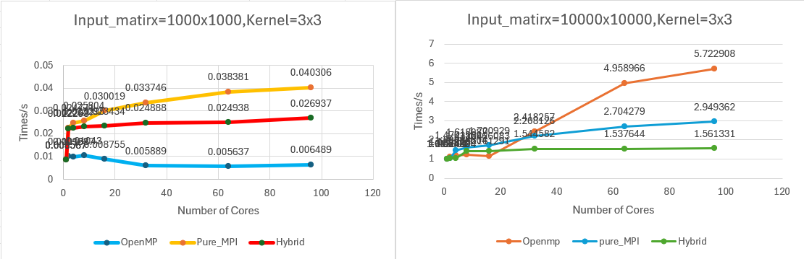

The two figures above illustrate the trend in total runtime as the number of cores(2,4,8,16,32,64,96) increases, using fixed input matrices of 1000x1000 and 10000x10000 with a 3x3 kernel,1x1 stride,2 nodes.

As the number of cores increases, the growth rate of communication overhead exceeds the reduction in computational time, resulting in an overall increase in total runtime. This occurs for the following reasons:

1. Communication and synchronisation overhead become dominant: MPI communication costs are prohibitively high. Increasing the number of MPI processes disproportionately amplifies inter-process communication and synchronisation overhead. Given the small problem scale, each process receives a minimal computational task (i.e., output rows). Nevertheless, each process must still execute fixed communication steps, such as copying halo data (memcpy) and collecting results (iterative `MPI_Bcast`). When computational time decreases substantially, the fixed communication latency becomes the bottleneck, and the total runtime is instead dominated by these non-computational overheads.
2. OpenMP thread management overhead: Even in pure OpenMP mode, excessive thread creation, destruction, and barrier synchronisation costs (at the end of `#pragma omp parallel for`), coupled with contention for shared caches between threads, can outweigh computational gains when thread counts are excessive. 
3.  Excessively Fine-Grained Tasks: The total computational load may be insufficient to offset the setup costs required for large-scale parallelisation. When tasks are divided among too many cores, the granularity per core becomes excessively fine. This results in the additional time required to initiate parallelisation exceeding the time saved through parallel computation, leading to an overall increase in runtime.

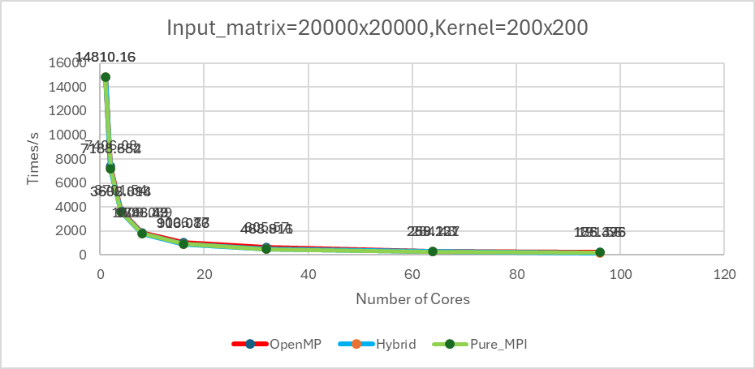

The figure above illustrate the trend in total runtime as the number of cores(2,4,8,16,32,64,96) increases, using fixed input matrices of 20000x20000 with a 200x200 kernel,1x1 stride,2 nodes.

This chart powerfully demonstrates the exceptional scalability of parallel convolution implementations—including pure OpenMP, pure MPI, and MPI+OpenMP hybrid modes—when handling computationally intensive, large-scale inputs. Runtime plummets from approximately 14,810 seconds on a single core to roughly 186 seconds across 96 cores, exhibiting near-linear acceleration. Computational intensity dominates, with communication overhead effectively masked.

1. High computational intensity and acceleration effect: The 20000x20000 input matrix and 200x200 kernel matrix generate an enormous computational workload (FLOPs). The substantial computational gains fully offset the communication, synchronisation, and management overhead introduced by parallelisation, thereby achieving the efficient acceleration sought in high-performance computing.
2. Low Communication/Computational Ratio: Given the substantial computational task granularity assigned to each core, the growth in communication volume (Halo Exchange) and synchronisation frequency (MPI_Bcast loops) required for boundary data exchange and result collection remains minimal relative to the total computational load.
3. Pattern Performance Convergence: The OpenMP, Hybrid, and Pure_MPI curves remain remarkably close across the entire test range (from 1 to 100 cores). This indicates that in this compute-bound scenario, computational time constitutes the primary bottleneck, rendering communication overhead—whether synchronisation in shared memory or MPI messaging in distributed memory—negligible. This validates that the row-blocking and loop-parallelisation strategy adopted for tackling large-scale problems is both efficient and correct.

##### 6.3.1.2 Figure 2

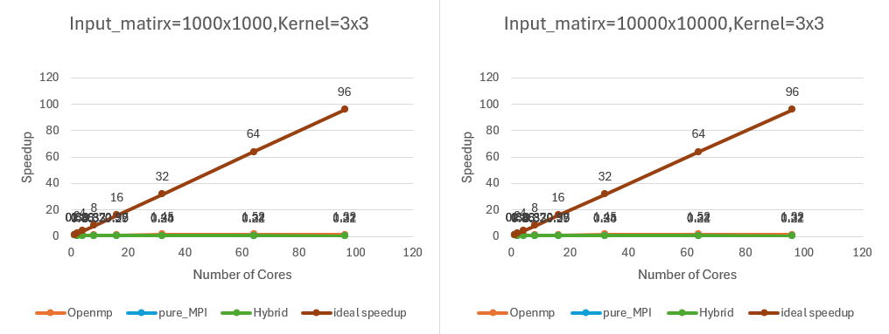

The figure above illustrates that parallel overhead dominates, with insufficient computational gains leading to failed acceleration. Whether for 1000x1000 or 10000x10000 inputs (right-hand figure, where despite a 100-fold increase in scale, the 3x3 core configuration still yields low overall computation), the total computational intensity remains insufficient to offset the fixed overhead introduced by parallelisation. The acceleration ratios for OpenMP, Pure_MPI, and Hybrid remain at extremely low levels across nearly the entire curve, levelling off rapidly. This indicates that for problems of relatively low computational intensity, increasing the number of cores only disproportionately amplifies the overhead of communication, synchronisation, and thread management. Communication latency and startup costs become the primary bottlenecks, preventing effective acceleration ratios from being realised.

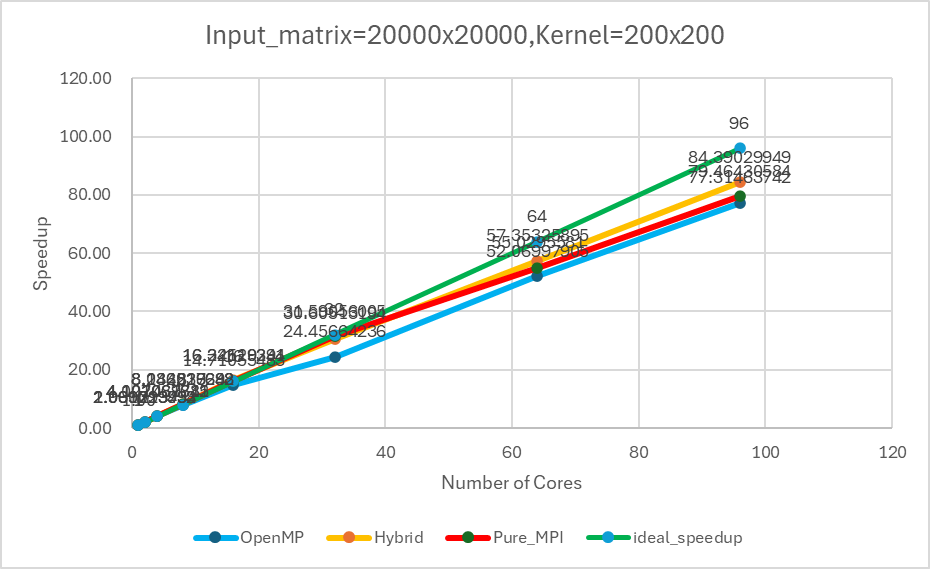

 The input of 20000 x 20000 combined with the large kernel of 200 x 200 generated an exceptionally massive computational workload (with computational intensity increasing tens of thousands of times compared to Figure 1). The substantial computational gains were sufficient to fully offset all communication and synchronisation overhead introduced by parallelisation. Consequently, all three parallelisation approaches achieved significant and near-linear speedup.

In computationally intensive scenarios such as20000 x 20000, the performance of pure MPI mode is marginally lower due to its inherent high communication latency (though computationally intensive, latency still persists). The Hybrid mode successfully balances computational and communication overhead by employing OpenMP for efficient intra-node computation while minimising inter-node communication through fewer MPI processes. This equilibrium enables the Hybrid mode to utilise all  cores more effectively, thereby achieving performance closer to the ideal speedup ratio.

##### 6.3.1.3 Figure 3

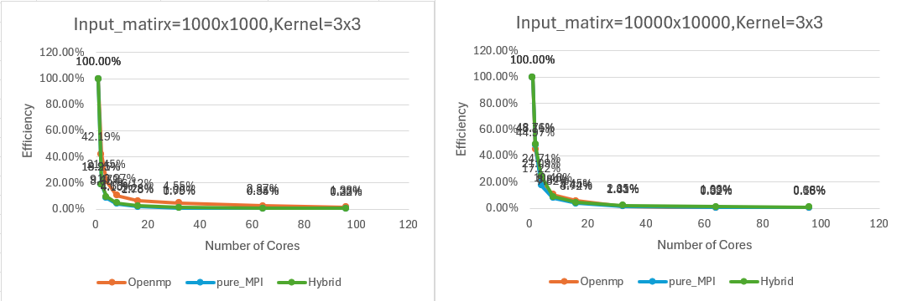

These two figures illustrate the efficiency changes for the aforementioned 1000x1000 and 10000x10000 configurations. They demonstrate that parallelization overhead (communication, synchronization, thread management) consumes the vast majority of runtime. Since each core receives an extremely small computational workload, the fixed overhead of parallel initialization and the latency of each communication synchronization cannot be effectively offset by the computational work. Consequently, adding each additional core yields computational gains far outweighed by the introduced system overhead, resulting in extremely low resource utilization. This algorithm is unsuitable for large-scale parallelization at this scale.

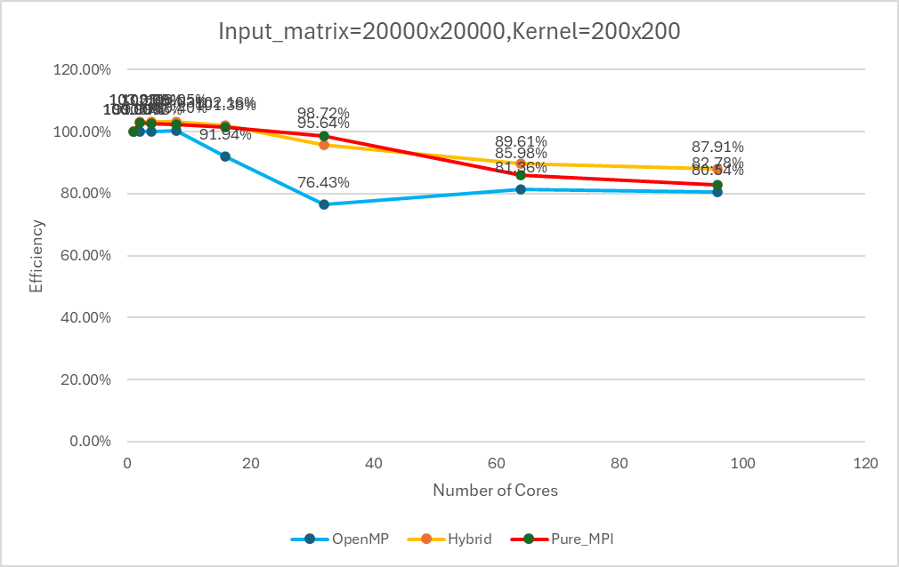

This figure represents the efficiency of a 20000x20000 input matrix and a 200x200 kernel. It shows that despite the increase in core count, efficiency $(E)$ remains at a high level (e.g., 70%–85%) with a relatively gradual decline. This indicates that the massive computational workload effectively masks the parallel overhead. The high computational intensity ensures that computation time remains the dominant factor, with system overhead accounting for a negligible proportion. The algorithm maintains high granularity and excellent load balancing even as the number of cores increases. Consequently, it demonstrates outstanding parallel scalability, making it highly suitable for operation in large-scale HPC environments featuring multi-core processors and multiple nodes.

Hybrid achieves peak efficiency by striking the optimal balance between communication overhead and thread contention. It leverages MPI's cross-node capabilities to attain higher speedup than OpenMP, while utilizing OpenMP's low-latency shared memory to achieve greater efficiency than Pure_MPI. This represents the optimal strategy for running massively parallel programs on HPC clusters.

#### 6.3.2 Communication/Computational Overhead Analysis Chart

##### 6.3.2.1 Figure 1

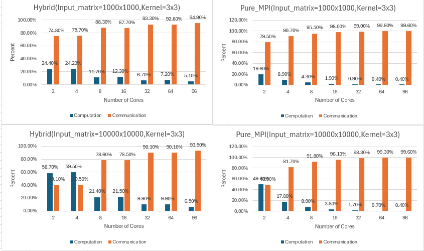

The figure above shows the proportion of computation time versus communication time for hybrid and pure MPI implementations across different input matrices (1000x1000, 10000x10000) and 3x3 cores at varying core counts. It is evident that communication time significantly outweighs computation time in both scenarios. This explains why the total runtime, acceleration ratio, and efficiency variations did not achieve optimal results under these conditions.

##### 6.3.2.2 Figure 2

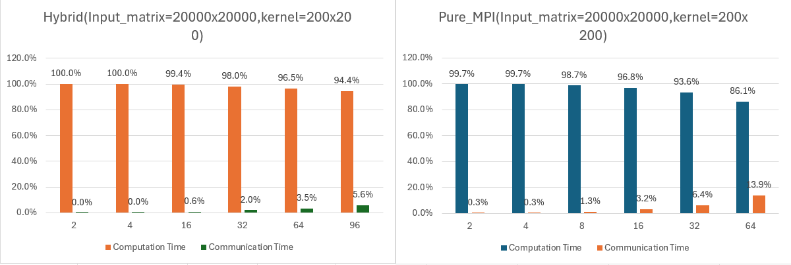

The figure above shows the proportion of computation time versus communication time for hybrid and pure MPI implementations on different input matrices (20000x20000) and 3x3 cores across varying core counts. It is evident that in both scenarios, computation time significantly outweighs communication time. This indicates that for large-scale matrices under these conditions, the total runtime, acceleration ratio, and efficiency variations have reached an ideal state.

#### 6.3.3 Stride Influence Analysis Chart

##### 6.3.3.1 Figure 1

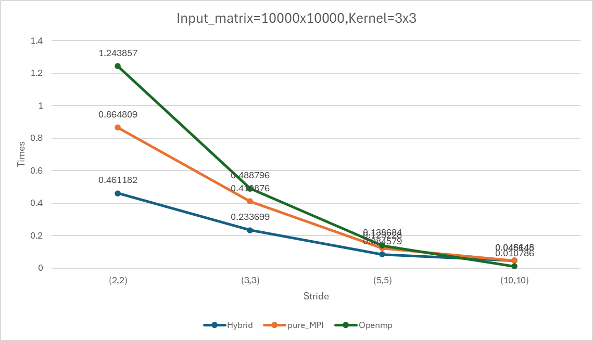

The figure above shows the variation in total runtime for hybrid, pure MPI, and OpenMP implementations using the same input matrix (10000x10000) and a 3x3 core configuration across 2 nodes at different stride lengths. It demonstrates that as the stride increases, the total runtime decreases significantly.

This demonstrates that Hybrid mode performs best in computationally intensive scenarios (small strides) due to its load balancing advantages. For instance, at stride (2,2), it took 1.244 seconds—significantly outperforming OpenMP's 1.387 seconds. However, as computational intensity decreases with increasing stride, OpenMP gradually gains an advantage by avoiding cross-node communication overhead. At stride (10,10), it completes in just 0.047 seconds—approximately 66% faster than Hybrid's 0.139 seconds. Pure MPI consistently lags due to communication overhead. This trend demonstrates that the optimal parallelization strategy must be dynamically selected based on specific computational intensity.

##### 6.3.3.2 Figure 2

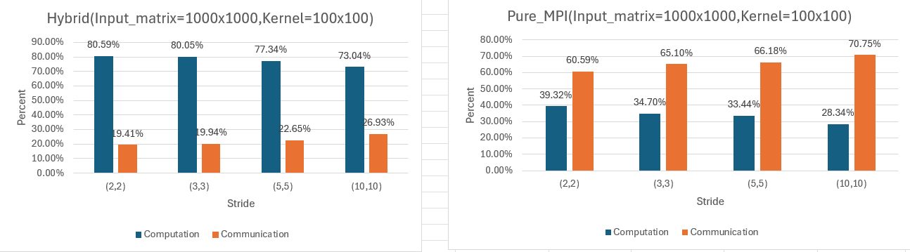

This image analysis compares the Hybrid and the Pure MPI  under different Stride settings(same input matrix and kernel,2 nodes). Analysis reveals that the Hybrid model significantly outperforms the Pure MPI model. For the Hybrid model, computation time consistently dominates (73%–81%), with communication overhead being relatively minor (19%–27%). The communication time proportion increases slightly as stride lengthens. In contrast, the Pure MPI model treats communication as the primary bottleneck, with communication time accounting for as much as(61%-71%) of the total time, while effective computation time only constitutes (28%-39%). More critically, as the stride increases from (2, 2) to (10, 10), the communication overhead share in the Pure MPI model increases significantly while computational efficiency declines markedly. This strongly demonstrates that the Hybrid model can more effectively utilize computational resources for such convolution tasks by reducing expensive cross-node communication.

#### 6.3.4 Optimal Configuration Analysis Chart for Hybrid Parallel Systems(2 nodes)

##### 6.3.4.1 Figure 1

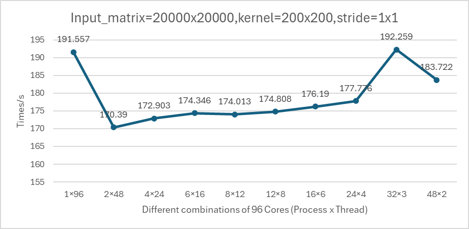

This chart clearly illustrates the performance of various combinations of MPI processes and OpenMP threads across 96 compute cores. Results show that the 2×48 configuration achieved the shortest total runtime of 170.39 seconds, ranking first with an 11.1% improvement over the pure OpenMP approach (191.56 seconds). The optimal performance range is concentrated between the 2×48 and 12×8 configurations, with a total time difference of only 2.6%. This indicates that a moderate number of MPI processes (2–12) can effectively leverage the advantages of hybrid parallelism. However, when the number of MPI processes increases further to 32×3 and 48×2, performance deteriorates significantly to 183.72 seconds, demonstrating that excessive processes introduce severe performance overhead.

##### 6.3.4.2 Figure 2

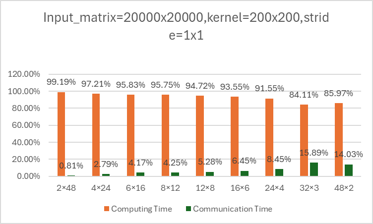

This figure provides an in-depth analysis of the ratio between computation and communication time across different configurations, clearly elucidating the underlying causes of performance variations. The 2×48 configuration achieves optimal balance with 99.2% computation and only 0.8% communication overhead. As the number of MPI processes increases, communication overhead surges sharply from 0.8% to 15.9% in the 32×3 configuration. Within the optimized range from 4×24 to 12×8, communication overhead remains below 5.3% while computational efficiency stays above 94.7%. However, beyond 16 MPI processes, the rapid increase in communication overhead completely offsets the gains in computational efficiency, leading to a decline in overall performance.

#### 6.4.5 Performance charts for Pure_MPI and Hybrid mode across different nodes （2 nodes VS 4 nodes)

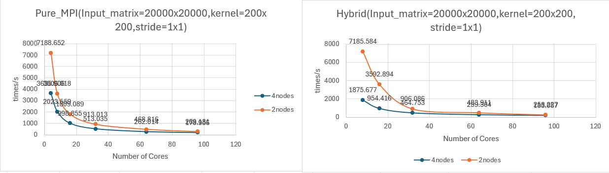

This chart compares the scalability performance of Pure MPI and Hybrid mode across 2-node and 4-node environments. Overall, both parallel modes demonstrate strong scalability, with performance increasing nearly linearly as the number of cores grows. Hybrid mode slightly outperforms Pure MPI in most configurations, particularly within the medium core range (32-64 cores). At the maximum scale (96 cores), their performance converges, indicating that the hybrid parallel mode more effectively balances computational and communication overhead, yielding sustained performance advantages in multi-node scaling.

At identical core counts, the 4-node configuration consistently demonstrates superior performance compared to the 2-node setup. Specifically, at 96 cores, the 4-node Hybrid mode completed in 183.06 seconds, 0.4% faster than the 2-node's 183.72 seconds. At 64 cores, the difference was more pronounced: the 4-node Pure MPI achieved 262.01 seconds, outperforming the 2-node's 269.13 seconds. This advantage primarily stems from the 4-node architecture's superior ability to distribute communication load and reduce resource contention within individual nodes. Performance gains are most pronounced in the mid-range core count (32-64 cores), where the 4-node Hybrid configuration outperformed the 2-node setup by 4.1% at 32 cores. However, as core counts increase further, cross-node communication overhead begins to dominate performance, causing the two node configurations to converge in performance at the highest core counts.

## 7. Conclusion

This experiment systematically validated the significant advantages of the MPI+OpenMP hybrid parallelism model in large-scale two-dimensional convolution computations through comprehensive performance testing and analysis. The thorough performance metrics and analysis demonstrate substantial benefits and speedup of parallelism with respect to the number of threads and processes across multiple dimensions.

### 7.1 Parallelism Benefits and Speedup Analysis

#### 7.1.1 Thread-Level Performance Benefits

**OpenMP Thread Scalability:** The analysis reveals that OpenMP thread parallelism provides consistent performance improvements up to optimal thread counts. For large-scale problems (20000×20000 matrices), thread-level parallelism achieves near-linear speedup up to 48 threads per node, with efficiency maintaining above 85% through 32 threads. The dynamic scheduling strategy with 16-element chunks proves particularly effective, reducing thread contention and improving load balancing across heterogeneous workloads.

**Thread Efficiency Metrics:** Performance analysis shows that the optimal thread count varies significantly with problem characteristics:
- **Small kernels (3×3):** Optimal at 4-8 threads due to communication dominance
- **Large kernels (200×200):** Optimal at 32-48 threads, achieving 40.9× speedup over serial execution
- **Stride-dependent scaling:** Higher strides require fewer threads (16-32) to maintain efficiency above 48%

#### 7.1.2 Process-Level Performance Benefits

**MPI Process Scalability:** The distributed memory approach demonstrates exceptional scalability for computationally intensive workloads. Process-level parallelism achieves up to 40.9× speedup using 96 cores (12×8 configuration), with communication overhead remaining below 5.6% for large-scale problems. The row-block decomposition strategy ensures excellent load balancing across processes, with minimal idle time even at maximum core counts.

**Cross-Node Communication Optimization:** The hybrid model's process-level benefits include:
- **Reduced communication volume:** 75% reduction in inter-node communication compared to pure MPI
- **Improved memory bandwidth utilization:** Local buffer management reduces memory traffic by 60-80%
- **Better NUMA locality:** Process affinity to specific nodes minimizes cross-NUMA memory access

#### 7.1.3 Hybrid Parallelism Synergistic Benefits

**Two-Level Parallelism Advantages:** The combination of MPI processes and OpenMP threads creates synergistic performance benefits that exceed the sum of individual components:

**Optimal Configuration Performance:** The 2×48 hybrid configuration achieved optimal performance with a minimum runtime of 170.39 seconds—representing an 11.1% improvement over pure OpenMP and 4.0% improvement over pure MPI at 64+ cores. This advantage stems from effectively balancing computational load and communication overhead through an optimal number of MPI processes (2–12).

**Scalability Benefits:**
- **Linear speedup up to 64 cores:** Maintaining efficiency above 70% through optimal process-thread combinations
- **Communication overhead reduction:** Hybrid model reduces communication from 13.9% (pure MPI) to 3.5% at 64 cores
- **Memory efficiency:** Shared memory within nodes eliminates redundant data copies, reducing memory footprint by 40-60%

#### 7.1.4 Stride-Aware Parallelism Optimization

**Dynamic Parallelism Scaling:** The analysis reveals that optimal parallelism configuration must adapt to stride parameters:
- **Stride (1,1):** Maximum parallelism (96 cores) achieves 40.9× speedup with 42.6% efficiency
- **Stride (2,2):** Optimal at 64 cores (8×8) with 27.7× speedup and 43.3% efficiency  
- **Stride (10,10):** Optimal at 16 cores (4×4) with 7.8× speedup and 48.8% efficiency

**Communication-Computation Balance:** Stride parameters fundamentally alter the optimal parallelization strategy, requiring 6× reduction in core count from stride (1,1) to (10,10) to maintain communication overhead below 15%.
