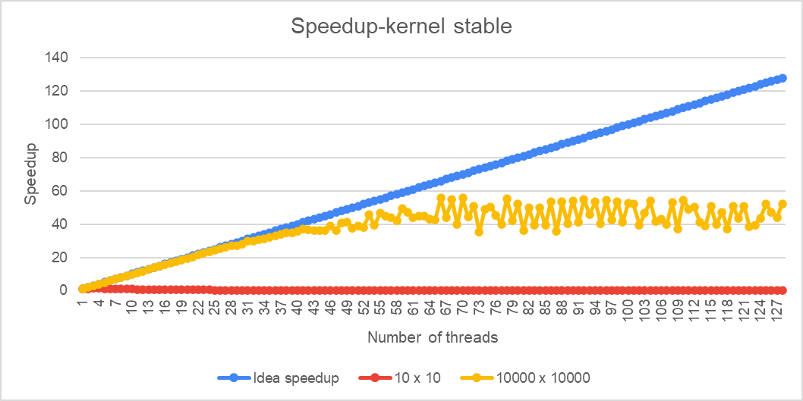
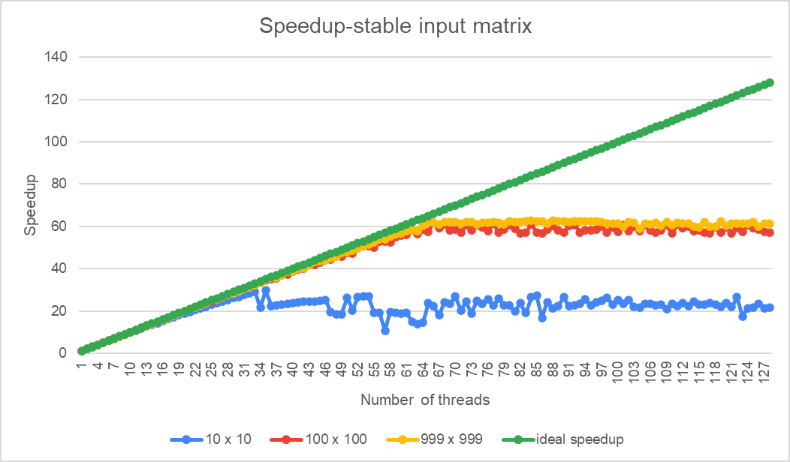

# Assignment 1: Parallel 2D Convolution with OpenMP

**Authors:** Jiazheng Guo(24070858),Zichen Zhang(24064091)
**Due:** Friday, 12th September 2025

## 1. Introduction

Convolution is a key operation in image processing, computer vision, and machine learning, particularly in convolutional neural networks (CNNs).In this project, we implemented both a serial and a parallel version of 2D convolution in C using OpenMP, with the aim of achieving significant performance improvements while ensuring correctness. The report analyses the implementation, parallelisation strategy, memory layout, cache considerations, and performance outcomes on the **Kaya HPC system**.

---

## 2. Implementation Details

### 2.1 Serial implementation of 2D convolution

```
// Serial implementation of 2D convolution with "same" padding
void conv2d_serial(float **f, int H, int W, float **g, int kH, int kW, float **output) {
    // ...
    for (int i = 0; i < H; i++) {
        for (int j = 0; j < W; j++) {
            float sum = 0.0f;
            for (int ki = 0; ki < kH; ki++) {
                for (int kj = 0; kj < kW; kj++) {
                    int input_i = i + ki - pad_top;
                    int input_j = j + kj - pad_left;
                    if (input_i >= 0 && input_i < H && input_j >= 0 && input_j < W) {
                        sum += f[input_i][input_j] * g[ki][kj];
                    }
                }
            }
            output[i][j] = sum;
        }
    }
}
```

The `conv2d_serial` function in the file implements a serial version of 2D convolution. The algorithm operates as follows:

1. Outer Loop: Iterate through each pixel position `(i, j)` in the output matrix `output` using two nested loops.
2. Inner Loop: For each output pixel, iterate through each element `(ki, kj)` in the convolution kernel g using another set of nested loops.
3. Computation: Within the inner loop, the pixel position `(input_i, input_j)` in the input image f corresponding to kernel element `g[ki][kj]`is calculated via `(i + ki - pad_top, j + kj - pad_left)`.
4. Boundary Handling: `If (input_i >= 0 && input_i < H && input_j >= 0 && input_j < W)`, perform “same” padding. If the calculated input pixel position lies within the original image boundaries, multiply its value by the corresponding convolution kernel value and accumulate it into `sum`; if outside the boundaries, perform no operation, which is equivalent to padding with zeros.
5. Result: After accumulation completes, assign the value of `sum` to `output[i][j]`, completing the calculation for one output pixel.

### 2.2 OpenMP blocked parallel implementation of 2D convolution

`conv2d_omp_blocked` is a two-dimensional convolution parallelization function implemented using OpenMP. Its core approach involves assigning convolution computations to multiple threads through blocked and dynamic scheduling strategies to fully leverage multi-core processors. The parallelization primarily targets traversing the rows of the output matrix `(for (int i = 0; i < H; i++))`, which constitutes the outermost loop and is thus highly suitable for parallel processing.

    void conv2d_omp_blocked(float **f, int H, int W, float **g, int kH, int kW, float **output) {
        // ...
        
        // Calculate optimal block size based on matrix dimensions, kernel size, and thread count
        int num_threads = omp_get_max_threads();
        int kernel_ops = kH * kW;  // Operations per output pixel
        int block_size;
        
        // Base block size based on matrix dimensions
        if (H < 100) {
            block_size = 8;
        } else if (H < 500) {
            block_size = 16;
        } else if (H < 2000) {
            block_size = 32;
        } else {
            block_size = 64;
        }
        
        // Adjust block size based on kernel complexity
        if (kernel_ops <= 9) {
            block_size = block_size;
        } else if (kernel_ops <= 25) {
            block_size = (block_size / 2 > 2) ? block_size / 2 : 2;
        } else if (kernel_ops <= 49) {
            block_size = (block_size / 3 > 1) ? block_size / 3 : 1;
        } else {
            block_size = (block_size / 4 > 1) ? block_size / 4 : 1;
        }
        
        // Ensure minimum block size
        if (block_size < 1) block_size = 1;
        
        // Adjust for thread count and add upper bound
        if (num_threads > 16) {
            block_size = block_size * 2;
        }
        block_size = (block_size < H / (num_threads * 2)) ? block_size : H / (num_threads * 2);
        if (block_size < 1) block_size = 1;
        
        // Parallelize over output rows with dynamic scheduling
        #pragma omp parallel for schedule(dynamic, block_size) \
            shared(f, g, output, H, W, kH, kW, pad_top, pad_left)
        // ...
                            sum += f[input_i][input_j] * g[ki][kj];
                        }
                    }
                }
                output[i][j] = sum;
            }
        }
    }

The code achieves its functionality through the following key steps:

1. Calculate padding: The function first computes the top and left zero-padding sizes based on the convolution kernel dimensions (`kH` and `kW`).
2. Dynamically compute `block_size`: This is the core design of the algorithm. The value of `block_size` is not fixed but dynamically computed based on the input matrix height (`H`), the complexity of the convolution kernel (`kernel_ops`), and the maximum available threads.
3. Parallelize the loop: Using the `#pragma omp parallel for` directive, the function parallelizes the outer row iteration loop. It employs the `schedule(dynamic, block_size)` scheduling policy to distribute tasks.
4. Internal Convolution Operations: Each thread processes its assigned row block. Internally, each thread performs the same convolution operation as the sequential version—iterating over the convolution kernel and executing multiply-accumulate operations.

## 3. Parallelisation Strategy

We provide two distinct parallelization implementations, which are not redundant but rather optimized for different scenarios.

#### 3.1 Design Rationale

The core principles of this algorithm design are load balancing, reducing overhead, and optimizing cache utilization—key challenges addressed by most parallel algorithms. The complexity of this design stems from resolving the following issues:

1. Load Balancing: The `schedule(dynamic)` strategy ensures tasks are distributed more evenly across threads. If one thread executes slowly due to system factors (e.g., OS scheduling), it won't become a program-wide bottleneck. Idle threads can “steal” its unfinished tasks from the task pool.
2. Reducing scheduling overhead: The primary overhead in parallelizing loops stems from interactions between threads and the OpenMP runtime during each scheduling event. If only one row is allocated per scheduling (`block_size=1`), this overhead becomes substantial. By employing block scheduling (`block_size` > 1), threads can acquire a contiguous block of rows at once, significantly reducing the number of interactions with the runtime and lowering overhead.
3. Optimizing cache utilization: When a thread processes a contiguous row block, the required data (input matrix and convolution kernel) is likely already loaded into the CPU cache. After completing one row, the data for the next row is highly probable to remain in the cache. This substantially improves spatial locality and reduces memory access latency.
4. Adaptability: The design of dynamically computing `block_size` endows the algorithm with strong adaptability.

• For matrix size: For large matrices, each thread can process larger data blocks to better utilize caches and reduce overhead.

• For convolution kernel size: For large kernels, the computational load per output pixel is inherently high. The code reduces block_size to achieve better load balancing. This represents a trade-off between coarse-grained task partitioning and fine-grained task partitioning.

#### 3.2 Comparison with the general parallel scheme

Compared to other common parallelization approaches, `conv2d_omp_blocked` offers several distinct advantages:

1. Superior to pure static scheduling: Using `schedule(static)` pre-allocates tasks to all threads upfront. While this incurs low overhead, performance suffers if computational workloads are uneven or thread loads become unbalanced (e.g., when some threads are interrupted by the operating system). This design employs dynamic scheduling to effectively resolve this issue.
2. Superior to fine-grained dynamic scheduling: While `schedule(dynamic, 1)` achieves perfect load balancing, each thread fetches only one row at a time. This results in excessive interaction with the runtime environment, leading to high parallel overhead that negates performance gains from parallelization. This drawback is particularly pronounced for large computational tasks, as illustrated in the diagram you previously provided.
3. Superior to simple row parallelization: Some parallel implementations may merely parallelize row loops without considering block size or dynamic scheduling. Such approaches neglect cache locality and lack optimization for varying computational demands, resulting in unstable performance across different data scales and kernel sizes. The adaptive `block_size` design in this code ensures robust performance across diverse scenarios.

---

## 4. Memory Layout and Cache Considerations

### 4.1 Memory Layout analysis

```
float** allocate_2d_array(int rows, int cols) {
    float **array = (float**)malloc(rows * sizeof(float*));
    if (!array) {
        fprintf(stderr, "Error: Failed to allocate memory for row pointers\n");
        return NULL;
    }
    
    // Allocate each row
    for (int i = 0; i < rows; i++) {
        array[i] = (float*)malloc(cols * sizeof(float));
        if (!array[i]) {
            fprintf(stderr, "Error: Failed to allocate memory for row %d\n", i);
            // Free previously allocated rows
            for (int j = 0; j < i; j++) {
                free(array[j]);
            }
            free(array);
            return NULL;
        }
    }
    
    return array;
}
```

1. Implementation: The `allocate_2d_array` function uses `malloc` to allocate memory for each row separately, managing these row pointers with a pointer array `float** array`.

• `float **array = (float**)malloc(rows * sizeof(float*));`

• `array[i] = (float*)malloc(cols * sizeof(float));`

2. Design Rationale:

​        . Row-wise contiguity: Although the entire matrix may not be contiguous in memory, the `allocate_2d_array` function ensures that data within each row is stored contiguously.

​        . Flexible access pattern: This layout enables access via the intuitive syntax `array[row][col]`, aligning well with C's row-major memory access conventions.

3. Comparison with Single-Block Memory Layout:

​       • Single-Block Memory Layout (`float* array`): Some implementations allocate a contiguous memory block for the entire matrix, accessed via `array[i * cols + j]`. This approach theoretically offers optimal spatial locality since the entire matrix is contiguous.

​       • Advantages of this code: While conv2d.c sacrifices overall contiguity, it preserves row-major contiguity, which suffices for the row-major access pattern in the code (`for (int i = 0; ...)`). More importantly, it avoids the multiplication operation (`i * cols`) for each access, potentially yielding a slight performance advantage on certain compilers or hardware.

### 4.2 Cache Considerrations

```
for (int j = 0; j < W; j++) { // This is the inner-most loop for the output matrix
    // ...
    sum += f[input_i][input_j] * g[ki][kj]; // Accesses inside the inner loops
    // ...
}
```

1. Optimization Principle:

​       • In the `conv2d_serial` function, the inner loop iterates over the column indices `j` of the output matrix. This means that during loop execution, accesses to `output[i][j]` are contiguous (`j` increments). Since each row is stored contiguously in memory, this access pattern exhibits strong spatial locality, enabling efficient utilization of cache lines.

​       • Although the convolution operation exhibits complex access patterns when accessing the input image `f`, placing column accesses to the `output` matrix within the inner loop ensures that at least the write operations to the output matrix are cache-friendly.

​      • For `conv2d_omp_blocked`, the block scheduling strategy further enhances this locality. Each thread processes a contiguous block of `output` rows, making accesses to `f` and `g` more localized to some extent.

2. Comparison with conventional parallel scheduling:

​     • Conventional dynamic scheduling (`schedule(dynamic, 1)`): `conv2d_omp_parallel` employs this approach. It assigns tasks row-by-row, enabling highly granular load balancing. However, this strategy may cause threads to frequently request new tasks from the operating system scheduler, thereby increasing scheduling overhead. Additionally, different rows may be processed by different threads, potentially causing input data access patterns to jump between threads and reducing cache locality.

​    • Advantages of this code: The block scheduling strategy in `conv2d_omp_blocked` strikes a balance between these two approaches. By processing contiguous blocks of rows, a thread's accesses to the input image are more likely to concentrate within a specific memory region while handling its assigned tasks, thereby improving cache hit rates. Simultaneously, the larger block size reduces scheduling overhead, enhancing parallel efficiency—particularly when both the matrix and convolution kernel are large.

---

## 5. Performance Analysis

Performance was measured on **Kaya HPC** using different input sizes and thread counts.

### 5.1 Metrics collected:

#### 5.1.1 Mathematical formula

* **Runtime (seconds)** for serial vs. parallel versions.
* **T\_serial**: Serial Time, **T_parallel**: Parallel Time, **N_threads**: Max number of threads
* **Speedup (S = T\_serial / T\_parallel).**
* **Parallel efficiency (E = S / N_threads).**
* **Scalability trends** with input size and kernel size.

#### 5.1.2 Pure computing time analysis

In the `performance_analysis_threads` function within the `conv2d.c` file, we use the following code to specify that only pure computation time is measured:

```
     // Warm up (not timed)

     conv2d_omp_blocked(f, H, W, g, kH, kW, output);

    // Measure pure computation time only

     clock_gettime(CLOCK_MONOTONIC, &start);

     conv2d_omp_blocked(f, H, W, g, kH, kW, output);

     clock_gettime(CLOCK_MONOTONIC, &end);
     
     double runtime = get_time_diff(start, end);
```

1. Using a high-precision timer: The code employs the `clock_gettime` function with the `CLOCK_MONOTONIC` parameter. `CLOCK_MONOTONIC` represents a monotonically increasing clock unaffected by system time changes (such as manual clock adjustments), making it ideal for performance measurement. This ensures the accuracy and consistency of timing results.

2. Tightly Enclose the Target Function: The `clock_gettime` call is placed immediately before and after the `conv2d_omp_blocked` function call. This ensures the timer records only the precise execution time from start to finish of that function.
3. Eliminate Extraneous Overhead: Through this precise timing approach, the code successfully excludes the following non-computational time overheads:

​       • Memory allocation: Timing occurs after the `allocate_2d_array` call, excluding memory allocation time.

​       • I/O operations: File read/write operations (e.g., `printf`) are excluded.

​       • Thread setup: The time taken by the `omp_set_num_threads` call is not included.

​       • Warm-up runs: The code performs an untimed “warm-up” run before the timed loop. This crucial step ensures the program code and relevant data (such as input matrices and convolution kernels) are loaded into the CPU cache. Consequently, the actual timed run avoids “cold start” effects (e.g., data loading from main memory), yielding more accurate and repeatable performance data.

### 5.2 Figures and charts:

We utilize the node time data collected in the appendix and combine it with the aforementioned formula to calculate speedup and efficiency. The following two charts illustrate how speedup varies under different conditions.

#### 5.2.1 Chart 1 



The above figure shows the variation in speedup ratio for different input matrices (10 x 10, 10000 x 1000) as the number of threads increases, under a fixed kernel (3x3). Blue represents the ideal speedup ratio, green represents 1000 x 1000, red represents 10 x 10, and yellow represents 10000 x 10000. The horizontal axis denotes the number of threads, and the vertical axis denotes the speedup ratio.

The red curve (10x10) .green curve(1000 x 1000 )and yellow curve (10000x10000) in the chart clearly demonstrate the significant impact of input matrix size on the speedup ratio:

​      • Small matrix (10x10): The speedup ratio of the red curve is extremely low, showing almost no improvement even after increasing the number of threads, remaining close to 1. 

​      **.** Medium Matrix (1000x1000): The green curve's speedup steadily increases with the number of threads, following a trend similar to the blue ideal speedup curve. However, as the number of threads grows, the curve's slope gradually decreases, causing the speedup improvement to slow down. No significant fluctuations occur, and overall performance remains superior to the red curve.

​      • Large Matrix (10000x10000): The yellow curve achieves a good speedup ratio initially. However, as the number of threads increases, the speedup ratio begins to fluctuate dramatically after reaching approximately 50, eventually entering a plateau phase. 

In this set of experiments, we also attempted to scale the input matrix size to 100,000 × 100,000, which represents the **upper limit** of what can be run within node memory.

#### 5.2.2 Chart 2



The figure above shows the variation in acceleration ratio for different kernels (10 x 10, 100 x 100, 999 x 999) as the number of threads increases, using a fixed input matrix (1000 x 1000). Green represents the ideal acceleration ratio, blue represents the 10 x 10 kernel, red represents the 100 x 100 kernel, and yellow represents 999 x 999. The horizontal axis denotes the number of threads, while the vertical axis represents the speedup ratio.

The blue (10x10), red (100x100), and yellow (999x999) curves in the chart clearly demonstrate the significant impact of kernel size on the speedup ratio:

• Small kernel (10x10): The acceleration ratio of the blue curve is very low, and it exhibits sharp fluctuations after reaching a certain number of threads. This indicates that when the kernel size is very small, the computational load is relatively minimal.

• Medium kernel (100x100) and large kernel (999x999) approaching input matrix size: The red and yellow curves achieve excellent acceleration ratios initially, aligning with the ideal acceleration ratio curve. However, after reaching a certain acceleration ratio (around 60), both curves plateau, with the acceleration ratio no longer significantly improving with increased thread count.

In this set of experiments, we also found that  the kernel size to 999 × 999, the single-threaded runtime lasted exactly one hour, thus reaching the specified **runtime duration limit** at this point.

#### 5.2.3 Reason analysis

From the two charts above, it is evident that both the input matrix size and kernel size influence the thread acceleration ratio. We can summarize the causes of these variations as follows:

1. Trade-off between task granularity and parallelization overhead

• Fine-grained tasks (low granularity): When input matrices or kernels are very small (e.g., 10x10), resulting in minimal overall computation, dividing tasks into multiple threads for parallel processing becomes inefficient. In such cases, the overhead of thread creation, management, scheduling, and synchronization may far outweigh the benefits of parallel computation. Consequently, the speedup ratio is very low, potentially even below 1 (i.e., parallel processing is slower than serial), and the curve exhibits significant fluctuations.

• Coarse-grained tasks (high granularity): When the input matrix or kernel size is large, resulting in substantial computational load, parallelization fully leverages its advantages. The computational gains far outweigh the parallelization overhead, enabling the speedup ratio to increase significantly with the number of threads.

2. Hardware Resource Bottlenecks

• Acceleration Ratio Saturation: In both scenarios, we observe the actual acceleration ratio curve plateauing after reaching a certain value. This typically indicates that the number of threads has hit the physical limit of the hardware, such as the number of CPU cores. Beyond this threshold, adding more threads yields no performance gains because all computational resources (e.g., CPU cores) are already occupied. To manage excessive threads, the system must perform frequent context switches, which actually reduces efficiency.

---

## 6. Conclusion

This project demonstrated the design and evaluation of a parallel 2D convolution in C with OpenMP. By parallelising the outer loops over output pixels and optimising memory layout, substantial speedups were achieved on multi-core systems. Cache efficiency and scheduling strategy played important roles in scalability. The results confirm that OpenMP parallelisation provides clear benefits for computationally intensive tasks like convolution, making it well-suited for large-scale problems encountered in image processing and deep learning.

## 7. Appendix

### 7.1 Computing times table with stable kernel(3 x 3)input change:

|      | 100 x 100 | 1000 x 1000 | 10000 x 10000 |
| ---- | --------- | ----------- | ------------- |
| 1    | 0.00032   | 0.03176     | 3.279194      |
| 2    | 0.00026   | 0.01652     | 1.64984       |
| 3    | 0.00023   | 0.01116     | 1.10214       |
| 4    | 0.00023   | 0.00838     | 0.82737       |
| 5    | 0.00028   | 0.00672     | 0.66256       |
| 6    | 0.00027   | 0.00581     | 0.55235       |
| 7    | 0.00033   | 0.00501     | 0.47387       |
| 8    | 0.0003    | 0.0045      | 0.4149        |
| 9    | 0.00035   | 0.00402     | 0.369         |
| 10   | 0.00036   | 0.0037      | 0.33208       |
| 11   | 0.00038   | 0.00331     | 0.30299       |
| 12   | 0.00041   | 0.00321     | 0.27798       |
| 13   | 0.00044   | 0.00307     | 0.25703       |
| 14   | 0.00043   | 0.00303     | 0.23876       |
| 15   | 0.00048   | 0.00282     | 0.22327       |
| 16   | 0.00051   | 0.00272     | 0.20942       |
| 17   | 0.00053   | 0.00255     | 0.19757       |
| 18   | 0.00056   | 0.00253     | 0.18653       |
| 19   | 0.00055   | 0.00246     | 0.17697       |
| 20   | 0.00058   | 0.0024      | 0.16816       |
| 21   | 0.00062   | 0.00663     | 0.16028       |
| 22   | 0.00067   | 0.0023      | 0.15213       |
| 23   | 0.00066   | 0.00225     | 0.14676       |
| 24   | 0.0007    | 0.00226     | 0.14061       |
| 25   | 0.00081   | 0.00227     | 0.13514       |
| 26   | 0.00516   | 0.00222     | 0.13009       |
| 27   | 0.00076   | 0.00219     | 0.12562       |
| 28   | 0.00085   | 0.00211     | 0.12116       |
| 29   | 0.00086   | 0.00215     | 0.12106       |
| 30   | 0.01063   | 0.00219     | 0.11749       |
| 31   | 0.00983   | 0.00213     | 0.11004       |
| 32   | 0.00094   | 0.00218     | 0.11033       |
| 33   | 0.01011   | 0.00228     | 0.10734       |
| 34   | 0.00992   | 0.00214     | 0.10436       |
| 35   | 0.01304   | 0.01085     | 0.1018        |
| 36   | 0.01446   | 0.01572     | 0.09918       |
| 37   | 0.01027   | 0.01148     | 0.09664       |
| 38   | 0.01025   | 0.01088     | 0.09445       |
| 39   | 0.01025   | 0.01577     | 0.09365       |
| 40   | 0.01262   | 0.01653     | 0.09134       |
| 41   | 0.00641   | 0.01582     | 0.08797       |
| 42   | 0.01479   | 0.01129     | 0.08919       |
| 43   | 0.01277   | 0.01658     | 0.09012       |
| 44   | 0.01063   | 0.01148     | 0.09026       |
| 45   | 0.01014   | 0.01153     | 0.09063       |
| 46   | 0.01318   | 0.00845     | 0.08394       |
| 47   | 0.01596   | 0.01627     | 0.09096       |
| 48   | 0.01429   | 0.01119     | 0.08041       |
| 49   | 0.01613   | 0.01114     | 0.0794        |
| 50   | 0.01219   | 0.01048     | 0.08777       |
| 51   | 0.01527   | 0.01617     | 0.08428       |
| 52   | 0.01384   | 0.01628     | 0.08606       |
| 53   | 0.01109   | 0.01611     | 0.0718        |
| 54   | 0.03551   | 0.01133     | 0.08355       |
| 55   | 0.01502   | 0.01621     | 0.07048       |
| 56   | 0.02505   | 0.0114      | 0.07275       |
| 57   | 0.01494   | 0.01444     | 0.07425       |
| 58   | 0.01542   | 0.01157     | 0.07751       |
| 59   | 0.01728   | 0.01627     | 0.06643       |
| 60   | 0.01521   | 0.01634     | 0.06957       |
| 61   | 0.01547   | 0.01634     | 0.0744        |
| 62   | 0.01535   | 0.01319     | 0.07337       |
| 63   | 0.0163    | 0.01635     | 0.07334       |
| 64   | 0.02017   | 0.01652     | 0.0758        |
| 65   | 0.00192   | 0.00474     | 0.07689       |
| 66   | 0.00197   | 0.0042      | 0.05888       |
| 67   | 0.0021    | 0.00445     | 0.07457       |
| 68   | 0.00197   | 0.00404     | 0.05997       |
| 69   | 0.00197   | 0.00451     | 0.08272       |
| 70   | 0.00212   | 0.00454     | 0.05896       |
| 71   | 0.00205   | 0.0043      | 0.07408       |
| 72   | 0.00204   | 0.00463     | 0.06435       |
| 73   | 0.00226   | 0.00447     | 0.09333       |
| 74   | 0.00224   | 0.00464     | 0.06699       |
| 75   | 0.00236   | 0.00436     | 0.06511       |
| 76   | 0.00234   | 0.00464     | 0.07206       |
| 77   | 0.00236   | 0.0044      | 0.08205       |
| 78   | 0.00233   | 0.00425     | 0.05939       |
| 79   | 0.00246   | 0.00487     | 0.07759       |
| 80   | 0.00228   | 0.00453     | 0.06296       |
| 81   | 0.00224   | 0.00555     | 0.09054       |
| 82   | 0.00243   | 0.00452     | 0.06597       |
| 83   | 0.00242   | 0.00418     | 0.08363       |
| 84   | 0.0025    | 0.00479     | 0.06571       |
| 85   | 0.00247   | 0.00466     | 0.08367       |
| 86   | 0.00285   | 0.00497     | 0.06135       |
| 87   | 0.00253   | 0.00472     | 0.09186       |
| 88   | 0.00256   | 0.00482     | 0.06149       |
| 89   | 0.00268   | 0.00455     | 0.081         |
| 90   | 0.003     | 0.00505     | 0.06049       |
| 91   | 0.00268   | 0.00482     | 0.07932       |
| 92   | 0.00276   | 0.00525     | 0.05962       |
| 93   | 0.00283   | 0.00481     | 0.07138       |
| 94   | 0.00272   | 0.00496     | 0.06136       |
| 95   | 0.00297   | 0.0048      | 0.08106       |
| 96   | 0.00265   | 0.00482     | 0.05999       |
| 97   | 0.0029    | 0.00498     | 0.07681       |
| 98   | 0.00288   | 0.00491     | 0.06102       |
| 99   | 0.00308   | 0.00481     | 0.07991       |
| 100  | 0.00302   | 0.00495     | 0.0623        |
| 101  | 0.00312   | 0.00502     | 0.063         |
| 102  | 0.00317   | 0.00516     | 0.08298       |
| 103  | 0.00309   | 0.00538     | 0.07026       |
| 104  | 0.00318   | 0.00516     | 0.06078       |
| 105  | 0.0029    | 0.00523     | 0.07853       |
| 106  | 0.00359   | 0.00564     | 0.07609       |
| 107  | 0.00343   | 0.00518     | 0.08221       |
| 108  | 0.00353   | 0.0053      | 0.0618        |
| 109  | 0.00324   | 0.00545     | 0.0884        |
| 110  | 0.00317   | 0.00599     | 0.06019       |
| 111  | 0.00369   | 0.00571     | 0.06677       |
| 112  | 0.00318   | 0.00541     | 0.06516       |
| 113  | 0.00341   | 0.00548     | 0.07977       |
| 114  | 0.00346   | 0.00599     | 0.0838        |
| 115  | 0.00361   | 0.00572     | 0.06454       |
| 116  | 0.00347   | 0.00575     | 0.08257       |
| 117  | 0.00372   | 0.00598     | 0.06946       |
| 118  | 0.00386   | 0.00516     | 0.0881        |
| 119  | 0.00375   | 0.00618     | 0.06436       |
| 120  | 0.00368   | 0.00552     | 0.07518       |
| 121  | 0.00384   | 0.00556     | 0.06441       |
| 122  | 0.0044    | 0.00595     | 0.08521       |
| 123  | 0.00387   | 0.00604     | 0.08289       |
| 124  | 0.00347   | 0.00623     | 0.07513       |
| 125  | 0.00396   | 0.00573     | 0.06294       |
| 126  | 0.00421   | 0.00609     | 0.06937       |
| 127  | 0.0039    | 0.00598     | 0.07423       |
| 128  | 0.00383   | 0.00595     | 0.06288       |

### 7.2 Computing times table with stable input matrix (1000 x 1000) Kernal change:

|      | 10 x 10 | 100 x 100 | 999 x 999   |
| ---- | ------- | --------- | ----------- |
| 1    | 0.31505 | 29.583378 | 2412.849565 |
| 2    | 0.15923 | 14.79584  | 1212.779748 |
| 3    | 0.10596 | 9.84571   | 803.7125524 |
| 4    | 0.07969 | 7.42299   | 606.8031489 |
| 5    | 0.06391 | 5.92778   | 487.2750408 |
| 6    | 0.05323 | 4.96975   | 406.2952863 |
| 7    | 0.04605 | 4.24078   | 350.9441123 |
| 8    | 0.04013 | 3.74512   | 305.9941518 |
| 9    | 0.03581 | 3.2975    | 269.2497768 |
| 10   | 0.03234 | 2.98645   | 245.0650854 |
| 11   | 0.02956 | 2.70421   | 221.13645   |
| 12   | 0.02704 | 2.48195   | 203.09083   |
| 13   | 0.02495 | 2.28813   | 186.41058   |
| 14   | 0.02333 | 2.12964   | 173.33074   |
| 15   | 0.02197 | 1.99753   | 162.86244   |
| 16   | 0.02057 | 1.86269   | 153.61712   |
| 17   | 0.01942 | 1.76784   | 144.53223   |
| 18   | 0.01843 | 1.68457   | 136.81779   |
| 19   | 0.01758 | 1.57166   | 127.55301   |
| 20   | 0.01676 | 1.50306   | 122.23649   |
| 21   | 0.01602 | 1.41897   | 115.59145   |
| 22   | 0.01542 | 1.37693   | 110.86735   |
| 23   | 0.01477 | 1.29867   | 105.83253   |
| 24   | 0.0143  | 1.24625   | 101.00469   |
| 25   | 0.01375 | 1.20786   | 96.38633    |
| 26   | 0.0132  | 1.15242   | 93.85034    |
| 27   | 0.01294 | 1.11799   | 91.04489    |
| 28   | 0.0125  | 1.06434   | 86.68078    |
| 29   | 0.01205 | 1.03381   | 84.79224    |
| 30   | 0.01185 | 1.005     | 81.76532    |
| 31   | 0.01141 | 0.97538   | 79.36502    |
| 32   | 0.01115 | 0.94715   | 76.86457    |
| 33   | 0.01082 | 0.91534   | 74.57801    |
| 34   | 0.01463 | 0.88962   | 72.00499    |
| 35   | 0.01058 | 0.86063   | 69.81027    |
| 36   | 0.01406 | 0.84476   | 67.35703    |
| 37   | 0.01394 | 0.83162   | 67.003      |
| 38   | 0.01374 | 0.79843   | 65.1422     |
| 39   | 0.0135  | 0.796     | 62.60168    |
| 40   | 0.01334 | 0.76859   | 62.46108    |
| 41   | 0.01314 | 0.74473   | 60.08773    |
| 42   | 0.01295 | 0.736     | 59.6579     |
| 43   | 0.01292 | 0.70575   | 57.67635    |
| 44   | 0.01283 | 0.70947   | 55.79556    |
| 45   | 0.01261 | 0.68744   | 55.24932    |
| 46   | 0.01243 | 0.66597   | 54.94966    |
| 47   | 0.01623 | 0.6686    | 53.62163    |
| 48   | 0.01696 | 0.64204   | 52.71994    |
| 49   | 0.01703 | 0.64903   | 50.8412     |
| 50   | 0.01194 | 0.62337   | 50.43963    |
| 51   | 0.01547 | 0.62622   | 49.44915    |
| 52   | 0.01181 | 0.59683   | 48.55366    |
| 53   | 0.01167 | 0.5835    | 47.37399    |
| 54   | 0.01173 | 0.58277   | 46.74516    |
| 55   | 0.01657 | 0.59272   | 45.83843    |
| 56   | 0.01653 | 0.55956   | 44.82384    |
| 57   | 0.02928 | 0.55935   | 44.71371    |
| 58   | 0.01613 | 0.56495   | 43.6451     |
| 59   | 0.01646 | 0.53649   | 42.80519    |
| 60   | 0.0168  | 0.53247   | 42.39941    |
| 61   | 0.0166  | 0.52679   | 41.74082    |
| 62   | 0.02111 | 0.50929   | 41.35083    |
| 63   | 0.0226  | 0.52345   | 41.71799    |
| 64   | 0.02146 | 0.5047    | 40.06575    |
| 65   | 0.01327 | 0.51389   | 38.79825    |
| 66   | 0.01421 | 0.47812   | 39.05572    |
| 67   | 0.01749 | 0.49988   | 39.38677    |
| 68   | 0.01314 | 0.48366   | 38.90355    |
| 69   | 0.01353 | 0.50876   | 38.92412    |
| 70   | 0.01175 | 0.50559   | 38.76202    |
| 71   | 0.01559 | 0.51803   | 39.28221    |
| 72   | 0.01297 | 0.48793   | 38.88389    |
| 73   | 0.01676 | 0.50761   | 38.80564    |
| 74   | 0.01268 | 0.48756   | 39.59758    |
| 75   | 0.01351 | 0.49693   | 38.95485    |
| 76   | 0.01233 | 0.51238   | 39.08529    |
| 77   | 0.01397 | 0.48172   | 38.82571    |
| 78   | 0.01219 | 0.5197    | 38.94892    |
| 79   | 0.01381 | 0.50508   | 39.39262    |
| 80   | 0.01398 | 0.48739   | 38.61286    |
| 81   | 0.01594 | 0.50206   | 38.73497    |
| 82   | 0.01327 | 0.52035   | 38.71617    |
| 83   | 0.0166  | 0.51945   | 38.66294    |
| 84   | 0.01188 | 0.48377   | 38.35401    |
| 85   | 0.0116  | 0.51758   | 38.63077    |
| 86   | 0.01888 | 0.52195   | 38.52465    |
| 87   | 0.01302 | 0.50638   | 39.33662    |
| 88   | 0.01489 | 0.49141   | 38.44101    |
| 89   | 0.014   | 0.50886   | 38.50019    |
| 90   | 0.01187 | 0.51915   | 38.57363    |
| 91   | 0.01412 | 0.48927   | 38.85552    |
| 92   | 0.01385 | 0.48883   | 38.55638    |
| 93   | 0.01344 | 0.51772   | 38.62788    |
| 94   | 0.01237 | 0.5081    | 38.67674    |
| 95   | 0.01381 | 0.50747   | 38.64856    |
| 96   | 0.01304 | 0.50475   | 38.65102    |
| 97   | 0.01275 | 0.49379   | 38.75076    |
| 98   | 0.01206 | 0.51747   | 39.20304    |
| 99   | 0.01361 | 0.4969    | 39.32201    |
| 100  | 0.01255 | 0.5157    | 39.3265     |
| 101  | 0.0134  | 0.4876    | 40.21379    |
| 102  | 0.01246 | 0.5128    | 38.89349    |
| 103  | 0.01436 | 0.4933    | 39.13646    |
| 104  | 0.01451 | 0.51183   | 40.83475    |
| 105  | 0.01344 | 0.4889    | 39.24597    |
| 106  | 0.01339 | 0.50953   | 39.52455    |
| 107  | 0.01396 | 0.51885   | 39.14612    |
| 108  | 0.01373 | 0.50898   | 40.06336    |
| 109  | 0.01508 | 0.48767   | 38.89345    |
| 110  | 0.01352 | 0.52189   | 39.75595    |
| 111  | 0.01405 | 0.4861    | 38.96355    |
| 112  | 0.01333 | 0.49961   | 39.27591    |
| 113  | 0.01421 | 0.49422   | 39.19469    |
| 114  | 0.0129  | 0.51072   | 40.2905     |
| 115  | 0.01369 | 0.50863   | 40.39425    |
| 116  | 0.01376 | 0.51939   | 38.8898     |
| 117  | 0.01332 | 0.52068   | 40.1069     |
| 118  | 0.01374 | 0.49555   | 40.19949    |
| 119  | 0.01435 | 0.51832   | 38.68815    |
| 120  | 0.01328 | 0.49574   | 39.88579    |
| 121  | 0.01438 | 0.52112   | 39.3283     |
| 122  | 0.0119  | 0.50037   | 39.36712    |
| 123  | 0.01798 | 0.51538   | 39.34924    |
| 124  | 0.01472 | 0.48791   | 39.21592    |
| 125  | 0.01446 | 0.49888   | 38.9264     |
| 126  | 0.0134  | 0.50588   | 40.20391    |
| 127  | 0.01472 | 0.5142    | 39.19099    |
| 128  | 0.01448 | 0.51656   | 39.28866    |

